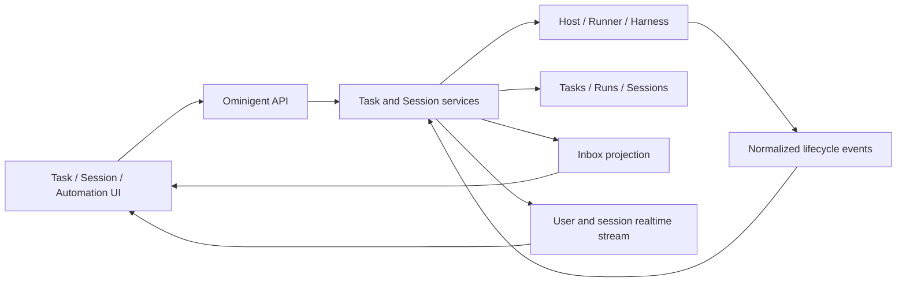

# Ominigent 产品信息架构与客户端体验升级方案

- 状态：Proposed
- 日期：2026-08-06
- 参考实现：同级仓库 `multica/`
- 范围：桌面端与 Web 端的产品信息架构、页面、数据模型与实施顺序
- 非范围：本方案不直接修改现有功能代码，不承诺 Multica 的团队协作语义原样迁入

## 1. 结论

Multica 最值得 Ominigent 借鉴的不是某一个页面，而是它已经形成了完整的“工作管理层”：用户可以先看到工作，再进入会话；先看到项目、智能体、运行环境和成本，再进入具体执行细节。

Ominigent 当前的优势在另一侧：会话执行、原生 Harness、Host/Runner、文件、终端、子 Agent、审批和实时流已经很强，但多数能力仍围绕单个 Session 展开。用户一旦离开当前会话，就很难回答以下问题：

- 我有哪些工作正在做、卡在哪里、哪些已经完成？
- 哪个 Agent 在哪个 Host 上工作？
- 某个项目一共有哪些会话、任务、产物和成本？
- 有哪些需要我处理的事情，又有哪些只是进度更新？
- Skills 实际来自哪里，哪些 Agent/Host 可以使用？

建议采用“借鉴 Multica 的信息架构与集合页模式，保留 Ominigent 的执行内核”的路线，分成三类工作：

1. **可以直接复刻视觉与交互结构的部分**：全局导航、集合页页头、表格/列表、筛选、状态徽标、空态、密度、暗色层次。
2. **可以利用现有后端快速补齐的页面**：Projects、Usage、Runtime、Agent Directory。
3. **必须补产品模型后再做的核心能力**：Task Board、持久 Inbox/Event Center、可管理的 Skills Catalog。

最重要的产品决策是：

> 不把 Session 直接重命名成 Task。Task 是持久工作目标，Session 是交互和执行上下文，Run 是一次具体执行。三者需要分开。

如果把 Session 直接当 Task，第一版会快，但很快会遇到无法表达重试、多次执行、人工 Review、同一任务下多会话、纯聊天不属于任务等问题，最终仍要迁移数据模型。

## 2. 源码盘点与可实施性结论

### 2.1 Multica 已有的可参考实现

Multica 的相关能力不是截图原型，而是完整的共享业务实现：

| 能力       | 主要实现位置                                                    | 可借鉴内容                                         |
| ---------- | --------------------------------------------------------------- | -------------------------------------------------- |
| 全局侧栏   | `multica/packages/views/layout/app-sidebar.tsx`                 | 导航分组、未读数、固定项、跨页面一致性             |
| 任务/Issue | `multica/packages/views/issues/`                                | 看板、表格、筛选、拖拽、详情、状态与执行活动分离   |
| Inbox      | `multica/packages/views/inbox/`、`multica/packages/core/inbox/` | 持久通知、已读/归档、严重级别、WebSocket 更新      |
| Projects   | `multica/packages/views/projects/`                              | 集合页、状态/优先级/进度、负责人、详情             |
| Agents     | `multica/packages/views/agents/`                                | Agent 集合页、运行状态、运行时、活动次数、详情页   |
| Usage      | `multica/packages/views/dashboard/`                             | KPI、时间范围、项目筛选、Agent/模型维度、失败分析  |
| Runtime    | `multica/packages/views/runtimes/`                              | 机器、运行时、健康状态、费用、版本、日志与控制动作 |
| Skills     | `multica/packages/views/skills/`                                | Skills 库存、来源、使用方、详情、文件树、批量操作  |

这些页面普遍使用“集合页页头 + 工具条 + ListGrid/表格 + 详情页”的一致结构。Ominigent 可以复用这种产品模式，但不应直接跨仓库 import Multica 的组件，因为双方的路由、状态和组件依赖不同。

### 2.2 Ominigent 已有能力

| 领域             | 当前实现                                                                                           | 判断                                                                                          |
| ---------------- | -------------------------------------------------------------------------------------------------- | --------------------------------------------------------------------------------------------- |
| 路由与 Shell     | `web/src/App.tsx`、`web/src/shell/AppShell.tsx`、`web/src/shell/Sidebar.tsx`                       | 可扩展，但当前以会话列表为中心，新增多个一级页面后需要重新组织导航                            |
| Projects         | `omnigent/entities/project.py`、`omnigent/server/routes/projects.py`、`web/src/lib/projectsApi.ts` | 已是一等实体，支持空项目、CRUD、配置和会话归档；非常适合优先补独立页面                        |
| Project 默认配置 | `web/src/shell/ProjectSettingsDialog.tsx`                                                          | 已支持默认 Host、工作目录、Agent、worktree，可直接进入项目详情页                              |
| Usage            | `omnigent/server/routes/usage.py`                                                                  | 已有 `/v1/usage`：今日、7 天、30 天、累计成本和会话明细；缺前端页面                           |
| Host/Runtime     | `omnigent/server/routes/hosts.py`、`web/src/hooks/useHosts.ts`、Native Bridge                      | 已有 Host 在线状态、Harness readiness、控制动作和文件系统能力；缺统一 Runtime 页面            |
| Agent Catalog    | `omnigent/server/routes/builtin_agents.py`、`web/src/hooks/useAvailableAgents.ts`                  | 已有只读 `/v1/agents`，含描述、Harness、MCP、Skills、终端；缺集合页和聚合活动字段             |
| Agent Instances  | `web/src/shell/SubagentsGraphView.tsx`、`SubagentsPanel.tsx`                                       | 已有当前 Session 的多 Agent 图和子会话状态；应保留为“运行实例”视图                            |
| Skills           | Session snapshot、Runner skill discovery、slash command                                            | 已能发现并调用，但没有全局可管理实体；第一版适合只读库存和诊断                                |
| Inbox            | `web/src/pages/InboxPage.tsx`                                                                      | 目前从所有 Session 派生待审批项，并叠加未读文件评论；没有通用持久通知模型                     |
| Automations      | `web/src/pages/TasksPage.tsx`、`scheduled_tasks` / `scheduled_task_runs`                           | 功能已较完整，但 `/tasks` 实际语义是 Automations，与未来 Task Board 冲突                      |
| 实时状态         | Session SSE + `WS /v1/sessions/updates`                                                            | 已能推送 running/waiting/idle/failed、审批、子 Agent、Usage 等，是 Inbox 和 Task 实时化的基础 |

### 2.3 必须先处理的现有技术债

Projects 已从 `omni_project` 标签升级为一等实体，但 Web 端仍保留双读和迁移逻辑。当前删除项目后，成员 Session 的 `project_id` 可能悬空；新建 Session 加入项目也仍有“先创建 Session，再 PATCH project_id”的非原子路径。

在新增 Projects 独立页面前，应先收口：

1. 统一以 `project_id` 为唯一来源，完成旧标签迁移与兼容代码退场计划。
2. 删除项目时在应用事务中清空成员 Session 的 `project_id`，不保留悬空引用。
3. `POST /v1/sessions` 原生接受并校验 `project_id`，避免创建后再 PATCH。
4. 增加项目 Session/Task 数量与最后活动时间的服务端聚合接口，避免前端扫描所有会话。

这些不是页面优化，而是项目列表、项目进度和 Usage 项目筛选可靠性的前置条件。

### 2.4 逐项决策：照抄、适配、增强或暂缓

| 节点                           | 决策               | Ominigent 方案                                 | 原因                                         |
| ------------------------------ | ------------------ | ---------------------------------------------- | -------------------------------------------- |
| 暗色层次、边框、圆角、列表密度 | 高保真复刻         | 落到本地 tokens 和集合页组件                   | 与业务模型无关，收益直接                     |
| 固定全局侧栏与菜单分组         | 适配复刻           | 个人/工作区/系统三组                           | 需要为 Chat 增加上下文会话面板               |
| 搜索与 `⌘K`                    | 增强现有           | 从命令搜索扩到 Task/Project/Session/Agent      | Ominigent 已有 Command Palette 热键基础      |
| `C` 新建任务                   | 新建               | 打开 Task composer，不等同于 New Session       | 需要先有 Task 对象                           |
| Inbox 未读数与归档             | 复刻语义           | 持久 read/archive，而非本地 seen               | 支持跨重启、跨设备                           |
| Inbox 只在需要审批时出现       | 明确增强           | 增加 Running、Completed、Failed、Review        | 正是当前用户感知断层                         |
| Chat                           | 保留并换壳         | 保留现有 Session、文件、终端与流式 UI          | 这是 Ominigent 强项，不应重写                |
| Task 看板/表格                 | 复刻交互，重建模型 | 独立 Task + TaskRun                            | Session 不能正确承载工作状态                 |
| Projects 集合页                | 适配复刻           | 基于现有 Project 增加统计和详情                | 后端地基已存在                               |
| Project 状态/优先级/负责人     | 部分暂缓           | 先加说明、图标、状态；暂不加负责人/优先级      | Owner-private 模型下价值有限                 |
| Automations                    | 保留增强           | `/tasks` 改 `/automations`，补运行结果与 Inbox | 当前能力已完整但命名冲突                     |
| Agents 集合页                  | 适配复刻           | 展示 Definition、可用性、Harness、活动         | “在线”需改为“可用”                           |
| 当前 Multi-agent 页面          | 增强现有           | Run team 的 List/Graph 双视图                  | 现有子 Session 图比 Multica 列表更有执行信息 |
| Usage KPI 与明细               | 先直接复刻         | 消费现有 `/v1/usage`                           | API 已存在，低成本高收益                     |
| Usage 趋势/Agent/Project 维度  | 增强               | 新增服务端聚合                                 | 不能靠前端扫描 Session                       |
| Runtime 机器详情               | 适配复刻           | Host → Machine，Harness/Runner → Runtime       | 与现有概念能稳定映射                         |
| Skills 列表                    | 分阶段适配         | 先库存/来源/冲突，再导入/绑定                  | 当前来源分散且写入所有权不清晰               |
| 列筛选、排序、列显示、批量选择 | 复刻               | 统一 CollectionToolbar/EntityTable             | 多个集合页都会复用                           |
| 固定/收藏                      | 增强现有           | 现有 pinned Session 扩展到 Project/Task        | 有稳定实体路由后成本可控                     |
| Settings 分组                  | 轻量适配           | 保留现有 Settings 子导航，视觉对齐全局侧栏     | 当前 Account/Admin/Desktop 分组合理          |
| Electron 顶部多标签            | 暂缓               | 数据证明高频切换后再做                         | 路由恢复和状态成本较高                       |
| Teams/Squads、项目级共享       | 暂不复制           | 继续 Session 级分享                            | 当前缺组织与项目 ACL 模型                    |

“高保真复刻”指交互与视觉结构，不代表从 Multica 跨仓库直接复制依赖。实现仍应遵循 Ominigent 的 React Router、TanStack Query、Zustand 和现有测试约束。

## 3. 建议的产品对象模型

### 3.1 对象边界

| 对象             | 含义                                                      | 生命周期                                               |
| ---------------- | --------------------------------------------------------- | ------------------------------------------------------ |
| Project          | 一组长期相关的工作、会话、默认配置和产物                  | 用户创建，长期存在                                     |
| Task             | 一个可完成、可审阅、可重试的工作目标                      | Backlog → Todo → In progress → Review → Done/Cancelled |
| Run              | Task 的一次实际 Agent 执行                                | Queued → Running/Waiting → Succeeded/Failed/Cancelled  |
| Session          | 人与 Agent 的持续交互上下文和执行记录                     | 可跨多个 Turn，可能不属于任何 Task                     |
| Agent Definition | 可选择的 Agent 模板、能力、Harness、Skills、MCP、Policies | 长期定义，可能由系统或管理员提供                       |
| Agent Instance   | 某个 Session/Run 中实际运行的主 Agent 或子 Agent          | 随执行产生和结束                                       |
| Runtime          | 一台 Host 上可运行的 Harness/Runner 能力                  | 随 Host 连接、安装、升级变化                           |
| Skill            | 可发现、可绑定、可调用的能力包                            | 来源可能是 Agent bundle、Host 用户目录或 Project       |
| Inbox Item       | 面向某个用户的持久工作事件投影                            | 未读/已读、活动/归档，可实时更新                       |

### 3.2 为什么必须分离 Task 状态与 Run 状态

Task 的 `in_review` 是产品流程状态；Run 的 `succeeded` 只是一次 Agent 执行成功。Agent 执行成功不等于工作被用户接受，反过来某次 Run 失败也不代表 Task 必须结束。

例如：

- Run 成功提交代码 → Task 进入 Review。
- 用户要求修改 → Task 回到 In progress，新建第二次 Run。
- 第二次 Run 失败 → Task 保持 In progress，同时 Inbox 产生失败项。
- 用户人工确认 → Task 进入 Done。

这也是 Multica 看板成熟的关键：工作状态和底层执行状态没有混在一起。

### 3.3 Agent Definition 与 Agent Instance 分离

Multica 的“智能体列表”展示的是长期 Agent；Ominigent 当前右侧 Agents rail 展示的是当前 Session 的子 Agent 实例。两者都需要，但不应继续共用模糊名称。

建议命名：

- 一级导航：**Agents**，展示 Agent Definitions。
- Session 右侧面板：**Run team** 或 **Agent team**，展示当前主 Agent 与子 Agent Instances。
- Agent 详情页中的 Activity：展示该 Definition 最近创建的 Session/Run。

## 4. 新的信息架构

### 4.1 一级导航

建议采用类似 Multica 的固定全局侧栏，但保留 Ominigent 的本地执行特点：

```text
用户 / Server 切换
搜索                     ⌘K
新建任务                  C

个人
  Inbox                   未读数
  Chat                    未读数
  My work                 可选，后续多人模式

工作区
  Tasks
  Projects
  Automations
  Agents
  Usage

系统
  Runtime
  Skills
  Settings
```

路由建议：

| 页面        | 路由                               | 备注                                                     |
| ----------- | ---------------------------------- | -------------------------------------------------------- |
| Chat        | `/`、`/c/:conversationId`          | 保留现有路由                                             |
| Inbox       | `/inbox`                           | 从审批页升级为事件中心                                   |
| Tasks       | `/tasks`、`/tasks/:id`             | 新的持久工作对象                                         |
| Projects    | `/projects`、`/projects/:id`       | 基于现有一等 Project                                     |
| Automations | `/automations`                     | 当前 `/tasks` 页面迁移至此；旧 `/tasks` 只在迁移期重定向 |
| Agents      | `/agents`、`/agents/:id`           | 初期只读                                                 |
| Usage       | `/usage`                           | 先消费现有 API                                           |
| Runtime     | `/runtimes`、`/runtimes/:hostId`   | Host 为机器，Harness/Runner 为机器内运行时               |
| Skills      | `/skills`、`/skills/:source/:name` | 初期只读与诊断                                           |
| Settings    | `/settings/:section`               | 保留现有结构                                             |

### 4.2 Chat 与全局导航如何共存

不建议把所有会话永久塞在全局菜单下方。菜单项增多后，当前 Sidebar 会失去清晰度。

建议：

- 全局侧栏始终固定。
- Chat 页面内部使用一个可折叠的会话/项目上下文面板，沿用当前 `Sidebar.tsx` 的绝大多数会话列表逻辑。
- Task/Project 详情通过内嵌 Activity/Run 面板进入具体 Session，不要求用户先跳到 Chat 再寻找对应会话。
- 小屏下全局侧栏和上下文面板分别变成抽屉，不同时占据宽度。

这样既获得 Multica 的稳定导航，又不丢失 Ominigent 已经成熟的会话列表和项目分组。

### 4.3 桌面顶部标签页

Multica 的顶部多标签体验很好，但不是第一优先级。Ominigent 当前没有跨页面 Tab 状态模型，直接复制会扩大路由持久化、恢复、深链接、关闭行为和移动端适配范围。

建议先完成全局导航和集合页；当用户确实频繁在 Task、Session、Inbox 之间来回切换后，再以 Electron-only 功能评估多标签。Web 端仍以普通路由/浏览器标签为主。

## 5. 核心页面设计

## 5.1 新建任务与任务看板

### 用户体验

“新建任务”应成为全局快捷动作，而不是简单打开新 Session。

新建面板首版只放必要字段：

- 标题，必填。
- 描述/验收标准，选填。
- Project，选填。
- Agent，选填；默认使用最近或项目默认 Agent。
- 执行目标：自动、指定 Host、Managed Sandbox。
- 工作目录/仓库；优先继承 Project 默认配置。
- 优先级：高/中/低/无。
- `创建后立即运行` 开关，默认开。

不在首版加入自定义字段、依赖图、工时、复杂标签和团队权限。

### 看板

默认列：

1. Backlog
2. Todo
3. In progress
4. Review
5. Done

Blocked 和 Cancelled 不作为常驻宽列：Blocked 以筛选或 In progress 内醒目标记呈现，Cancelled 默认隐藏。这样比直接复制 Multica 的所有状态更适合个人/小团队桌面工具，也减少横向滚动。

卡片信息优先级：

- Task 编号和标题。
- Project。
- 主 Agent。
- 最新 Run 状态：运行、等待用户、失败、完成。
- 子 Agent 进度，例如 `2/4`。
- 最后更新时间。
- 失败、需要输入、Review 三种强信号。

看板顶部支持：

- 全部 / 我的 / Agent / Project 快速范围。
- 搜索。
- Project、Agent、状态、更新时间筛选。
- 看板 / 表格切换。
- 当前工作的 Agent 数量。

### Task 详情页

详情页分四个稳定区域：

- Header：标题、状态、优先级、Project、Agent、运行按钮。
- Brief：描述、验收标准和附件。
- Activity：状态变化、用户消息、Agent 总结、失败、审批和评论的统一时间线。
- Runs：每次执行的状态、Session、耗时、模型、成本、产物和错误。

Run 点击后进入对应 Session；Task 页面保留返回上下文。

### 后端模型建议

`tasks`：

- `id`
- `owner_user_id`
- `project_id`，可空
- `title`
- `description`，可空
- `status`
- `priority`
- `agent_id`，可空
- `execution_target`
- `host_id` / `workspace`，可空
- `position`
- `created_at` / `updated_at` / `completed_at`

`task_runs`：

- `id`
- `task_id`
- `session_id`，可空直到 Session 创建成功
- `status`
- `started_at` / `finished_at`
- `error_code` / `error_message`
- `summary`，可空
- `cost_usd`，可空

遵循 Ominigent 当前数据库约束：关系由应用层校验和清理，不增加 DB Foreign Key；需要原子性的写入使用应用事务。

API：

- `POST /v1/tasks`
- `GET /v1/tasks?status=&project_id=&agent_id=&q=`
- `GET /v1/tasks/{id}`
- `PATCH /v1/tasks/{id}`
- `POST /v1/tasks/{id}/runs`
- `GET /v1/tasks/{id}/runs`
- `POST /v1/task-runs/{id}/cancel`

实时事件：

- `task.created`
- `task.updated`
- `task.deleted`
- `task.run.started`
- `task.run.progress`
- `task.run.waiting`
- `task.run.completed`
- `task.run.failed`

可复用现有 `scheduled_task_runs` 的状态、时间戳、错误分类和创建 Session 的实现方式，但不要让普通 Task 复用定时任务表；两者的定义生命周期不同。

### 验收标准

- 新建 Task 后立即出现在正确列，不需要刷新。
- 拖动更新失败时回滚，卡片不丢失。
- Agent Run 完成只将 Task 推到 Review，不自动标记 Done。
- 一项 Task 可以拥有多次 Run，每次 Run 都可追溯到 Session。
- 从 Task、Session、Inbox 三个入口看到的状态一致。

## 5.2 Inbox：从审批列表升级为事件中心

### 产品定位

Inbox 不应等同于“需要确认的审批”。它应该回答：

- 现在有什么必须由我处理？
- 哪些工作仍在运行？
- 最近哪些任务或会话结束、失败或需要 Review？

### 信息分类

建议四个筛选：

- **Action required**：审批、Agent 提问、权限/凭证问题、需要 Review。
- **Running**：正在执行的 Task/Session，一项 Run 一张持续更新的卡。
- **Updates**：完成、失败、取消、评论和重要里程碑。
- **All**：全部。

严重级别：

- `action_required`：必须处理，最高视觉优先级。
- `attention`：失败、阻塞、运行时离线。
- `info`：完成、取消、普通更新。

### 投送规则

一项 Run 使用同一个 `dedupe_key`，从启动到结束更新同一张卡，而不是每个进度事件生成一张新卡。

| 事件                                | Inbox 行为                               | 默认未读   |
| ----------------------------------- | ---------------------------------------- | ---------- |
| Session/Task Run started            | 创建或更新 Running 卡                    | 否         |
| Progress milestone                  | 更新摘要与时间                           | 否         |
| Waiting for approval/input          | 升级为 Action required                   | 是         |
| Run completed                       | 更新为 Completed，进入 Updates           | 是         |
| Run failed/Runtime offline          | 更新为 Attention                         | 是         |
| User opened the active Session      | 不自动清除必须处理项；普通进度可视为已读 | 视类型而定 |
| Scheduled Task run completed/failed | 投送最终结果并链接 Automation 和 Session | 是         |

“所有内部事件都投 Inbox”会迅速变成噪声，所以只持久化用户可理解的里程碑；token 流、工具调用和细碎子步骤只留在 Session Activity。

### 数据模型

不能继续通过“扫描所有 Session，再逐个抓 snapshot”的方式扩展。当前 `InboxPage` 为了找审批会 drain 全部分页并对命中的 Session 发 snapshot 查询，功能增加后成本会线性放大。

建议新增 `inbox_items`：

- `id`
- `recipient_user_id`
- `kind`
- `severity`
- `entity_type` / `entity_id`
- `session_id` / `task_id` / `project_id`，可空
- `dedupe_key`，同一 Run 的生命周期卡唯一
- `title` / `body`
- `state`：active/resolved
- `read_at` / `archived_at`
- `details_json`
- `created_at` / `updated_at`

API：

- `GET /v1/inbox?view=action_required|running|updates|all`
- `PATCH /v1/inbox/{id}`：read/archive
- `POST /v1/inbox/read-all`
- `GET /v1/inbox/unread-count`

实时：在现有 Session updates WebSocket 上增加 Inbox frame，或单独建立用户级 stream。事件只负责 patch/invalidate React Query；持久状态以 API 为准。

### 兼容迁移

第一阶段可以保留现有 ApprovalCard 交互组件，但 Inbox 列表来源切换为 `inbox_items`。审批请求生成持久 InboxItem，并在打开时按 `session_id + elicitation_id` 获取/提交详细表单。文件评论也投影为 InboxItem；原本的本地 seen registry 逐步退场。

### 验收标准

- App 重启或换设备后，未读、已读、归档状态仍然存在。
- Session/Task 结束后 1 秒级出现在 Inbox，无需打开对应会话。
- 同一 Run 从 Running 到 Completed 只占一张卡。
- Inbox 列表不需要扫描所有 Session。
- 审批在 Inbox 和 Session 任一处处理后，另一处实时消失或变为已处理。

## 5.3 Projects 列表与详情

### 第一版：利用已有模型快速上线

现有 Project 已支持 `name`、`config`、空项目、归档 Session。第一版无需立刻复制 Multica 的状态、优先级和负责人字段，可先展示真实可计算的信息：

- 名称。
- Session 数量。
- Task 数量；Task 上线前先隐藏。
- 活跃 Run 数量。
- 默认 Agent。
- 默认 Host/工作目录的安全显示名。
- 最后活动时间。
- 创建时间。

支持搜索、按最近活动/创建时间排序、表格/卡片切换、新建、重命名、归档/删除。

### 项目详情

建议 Tabs：

- Overview：说明、统计、默认配置。
- Tasks：项目任务看板/表格。
- Sessions：现有项目会话列表。
- Artifacts：文件、代码变更、链接；后续。
- Settings：默认 Host、工作目录、Agent、worktree。

现有 `ProjectSettingsDialog` 的表单可迁移到详情页 Settings，并保留对话框作为快速入口。

### 第二版字段

当 Task/项目流程稳定后，再加入：

- `description`
- `icon` / `color`
- `status`: planned/active/paused/completed/archived

项目优先级和负责人暂不复制。Ominigent 目前以个人或 Owner-private Project 为主，这两个字段在没有项目协作/成员分工之前价值有限。

### 必需接口

- `GET /v1/projects` 增加或配套返回 `session_count`、`task_count`、`running_count`、`last_activity_at`。
- `GET /v1/projects/{id}/sessions`，服务端分页。
- `GET /v1/projects/{id}/tasks`，Task 上线后。
- 创建 Session 原生接受 `project_id`。

## 5.4 Agents：目录页与当前运行团队

### Agents 目录页

第一版只读，数据基于现有 `/v1/agents`，补一条聚合接口或扩展字段：

- Agent 名称和描述。
- 来源：系统内置、服务器注册、会话临时。
- Harness。
- 可用性：至少一个可用 Host / 当前不可用 / 未知。
- 最近活动。
- Session/Run 次数。
- Skills、MCP、Policies 数量。

不要直接复制 Multica 的“在线”字段。Ominigent 的 Agent Definition 本身不是进程；更准确的是“Available”，依据至少一个 Host 的 Harness readiness、凭证和 Agent bundle 可加载性判断。

筛选：来源、Harness、可用性、最近活动。默认排序：最近活动。

### Agent 详情页

Tabs：

- Overview：描述、Harness、模型、来源、可用 Host。
- Capabilities：MCP、Policies、Terminal。
- Skills：Bundled Skills 与运行时发现 Skills，标明来源。
- Activity：最近 Tasks、Sessions、失败和成本。
- Instances：当前正在运行的 Session/子 Agent。

第一版不提供编辑。当前 `/v1/agents` 明确是 read-only，Agent 写入通过 Session 创建/Bundle 注册完成；贸然添加 CRUD 会模糊 Agent bundle、模板和 Session copy 的所有权。

### 当前 Session 的多 Agent 页面

保留现有 `SubagentsGraphView`，增加 List/Graph 切换：

- 主 Agent 固定在顶部。
- 子 Agent 显示 running/waiting/failed/idle。
- 显示当前动作摘要、开始时间、最近输出和子 Agent 数。
- 点击进入子 Session。
- Agent Definition 名称链接到 `/agents/:id`。

这部分比直接替换为 Multica 表格更符合 Ominigent 的执行可观测性优势。

## 5.5 Usage

### 第一版：直接消费现有 `/v1/usage`

这是最明确的低成本高收益页面：

- KPI：Today、Last 7 days、Last 30 days、All time。
- Session 表：名称、Agent/模型、最后活动、成本。
- 搜索、按成本/最近活动排序。
- 点击 Session 进入会话。

需要诚实呈现现有数据语义：

- 当前聚合按 UTC 日历日。
- 部分模型可能没有可定价成本。
- Session 的 per-model cost 可能不与 Session total 完全相加，现有 API 文档已经说明原因。

页面应显示 `Unpriced`/`Partial`，不能把未知成本画成 `$0`。

### 第二版：增加趋势与维度

扩展 Usage API，提供：

- 每日成本与 Token 趋势。
- 按 Agent、Model、Project、Host 聚合。
- 运行时长、Task/Run 数、失败率。
- 时间范围：1/7/30/90 天。

Project 筛选依赖 Session/Task 的 `project_id` 收口；Agent 维度依赖 Agent Definition 聚合；不能只在前端扫描 Session 拼装。

## 5.6 Runtime

### 概念映射

- Multica Machine ≈ Ominigent Host。
- Multica Runtime ≈ Host 上的 Harness/Runner 能力。
- Multica Agent 工作负载 ≈ Host 上运行的 Session/Task Run。

### Runtime 列表

每台机器一行/卡：

- Host 名称、在线/离线、是否本机。
- 最后心跳。
- 已配置 Harness 数量。
- Running/Waiting Session 数。
- 近 7 天成本；第二版。
- CLI/Daemon 版本；如果 Host hello 已提供，否则后端补字段。

### Runtime 详情

顶部：重命名、View logs、Restart、Stop；只有 Electron 本机或拥有远端控制权限时展示。

Harness 表：

- Claude/Codex/其他 Harness。
- Ready/CLI missing/Auth missing/Unknown。
- 版本。
- 当前 Agent/Session 数。
- 最近错误。

下方：Active Sessions、最近失败、费用趋势、Host 配置。

避免泄露绝对本地路径。沿用当前代码对工作目录的隐私策略，只显示 basename 或 home-relative 安全形式。

### 实现判断

列表与基础详情为中等成本：已有 `useHosts`、Harness readiness、Native Bridge 和控制 API。近 7 天成本、版本统一、日志入口权限需要补后端聚合或 Host hello 字段。

## 5.7 Skills

### 第一版：只读 Skills Inventory

Skills 的来源比 Multica 更分散：

- Agent bundle 内置。
- Session workspace / Project 范围。
- Host 用户目录。
- Harness/Plugin 自己发现。

因此第一版应解决“我有什么、来自哪里、哪里可用”，而不是直接做全量编辑。

列表字段：

- Name、Description。
- Source：Agent bundle / Project / Host user / Plugin。
- Available on：Host 数量。
- Used by：Agent Definitions 数量。
- 最近发现时间。
- 冲突/遮蔽状态。

详情：

- 来源路径的安全显示。
- Frontmatter 与说明。
- 哪些 Agent/Host 可用。
- 同名 Skill 的优先级与冲突。
- 最近调用 Session；后续。

### 第二版：导入、绑定和启停

在定义清楚 canonical storage 之后再提供：

- 从本地目录/GitHub 导入。
- 绑定到 Agent Definition。
- 对某个 Project 启用/禁用。
- 复制为可编辑版本。

直接编辑 Host 文件系统上的原始 Skill 风险较高：可能覆盖用户文件、破坏 Harness 自己的插件管理或在多 Host 间产生漂移。建议采用“导入到 Ominigent 管理存储 → 显式同步/绑定”的模型，而不是静默覆盖原文件。

## 5.8 Automations

当前 `/tasks` 实际上已经是较完整的 Automations 页面。建议：

- 改名并迁移到 `/automations`。
- 保留 Active/Paused、Run now、Edit、Delete 和 Suggestions。
- 增加最近 Run 状态、下次运行、最近 Session 链接。
- Automation 的每次完成/失败投送 Inbox。
- 可选绑定 Project，使其产生的 Task/Session 自动归档到项目。

不要把 Automation 定义行混入 Task Board。Automation 是“产生工作/执行的规则”，Task 是“要完成的工作”。

## 6. UI 视觉与交互规范

### 6.1 可以直接借鉴的视觉语言

- 深色背景使用 3 层而不是纯黑一层：App 背景、Surface、Raised Card。
- 1px 低对比边框，圆角以 8/10/12px 三档为主。
- 12px 辅助信息，13–14px 列表正文，18–24px 页标题。
- 状态颜色只用于点、图标、细边或轻背景，不整块高饱和填充。
- 表格行高 44–48px，Hover 才显示复选框和更多菜单。
- 顶部工具条高度、搜索框、筛选按钮在所有集合页保持一致。
- 空态、Loading skeleton、Error + Retry 使用统一结构。
- 长文本必须明确 truncate、tooltip 和水平滚动策略。

### 6.2 Ominigent 本地应抽取的最小共享组件

Ominigent 不需要复制 Multica 的整个 UI package。建议只抽取出现至少三次的页面级原语：

- `CollectionPageHeader`
- `CollectionToolbar`
- `EntityTable`
- `StatusBadge`
- `SegmentedFilter`
- `CollectionState`：loading/empty/error
- `EntityRowMenu`

这些组件只负责布局和视觉，不包含 Task/Project/Agent 业务逻辑。Projects、Agents、Runtime、Skills、Usage 共用，可以显著降低后续页面风格漂移。

### 6.3 状态色建议

| 语义                         | 色彩用途                    |
| ---------------------------- | --------------------------- |
| Backlog / Idle / Unknown     | 中性灰                      |
| Todo / Info                  | 蓝色                        |
| In progress / Running        | 黄或琥珀                    |
| Review / Waiting user        | 紫或绿色，需与 Success 区分 |
| Done / Available             | 绿色                        |
| Failed / Blocked / Attention | 红色                        |
| Cancelled / Archived         | 降低透明度                  |

不能只靠颜色表达状态；必须同时有文本、图标或形状。

### 6.4 不建议照抄的 UI

- 第一阶段不做桌面多标签。
- 不复制所有项目字段和团队负责人列。
- 不把 6–7 个看板列同时常驻，优先保证常见 5 列可读。
- 不把每个实时事件都做成 Inbox 未读。
- 不把 Agent Definition 标记成简单“在线/离线”。
- 不把 Skills 编辑等同于直接修改 Host 上用户文件。

## 7. 技术架构建议

### 7.1 前端

继续沿用 Ominigent 当前技术栈：React Router、TanStack Query、Zustand、Tailwind/Radix。

- 服务端实体由 TanStack Query 管理。
- 视图筛选、列显示、看板/表格模式放 Zustand 或现有本地偏好层。
- WebSocket 只 patch/invalidate Query cache，不作为持久事实来源。
- 看板拖拽可以乐观更新，但必须保存 rollback snapshot。
- 新页面按路由懒加载，避免 Chat 主 bundle 继续膨胀。

### 7.2 后端

- Tasks、Task Runs、Inbox Items 使用独立持久表。
- 生命周期写入与 Inbox 投影应由服务层统一触发，不能散落在多个 Harness adapter。
- Framework/Harness 只上报规范化事件；服务层决定 Task 状态和用户通知。
- Project/Agent/Usage 列表的 count、last_activity 和聚合字段由服务端计算。
- 所有用户级列表都有 owner/ACL 过滤、游标分页和稳定排序。

### 7.3 事件流



关键点：Inbox 是领域事件的持久投影，不是浏览器从 Session 状态临时推断出来的列表。

## 8. 优先级与实施路线

### Phase 0：基础与语义收口

目标：后续页面建立在稳定对象和一致 UI 上。

- 新全局导航和路由骨架。
- 集合页 UI 原语与设计 tokens 微调。
- `/tasks` Automations → `/automations` 路由迁移方案。
- Projects `project_id` 单一来源、删除清理和原子创建归档。
- 定义 Task/Run/Inbox 事件契约。

验收：现有 Chat、Inbox、Automations、Settings 功能无回归；Project 归档不再出现悬空成员。

### Phase 1：低风险高价值页面

目标：快速建立 Multica 式的“系统全貌”。

- Projects 列表与详情第一版。
- Usage 第一版，直接消费 `/v1/usage`。
- Runtime 列表与 Host 基础详情。
- Agents 只读目录与详情。
- Automations 页面改名与 Inbox 结果链接预埋。

这几项大部分建立在现有 API 上，适合并行开发，也是验证新 Shell 和集合页组件的最佳范围。

### Phase 2：Task 与持久 Inbox

目标：把 Ominigent 从“会话客户端”升级为“Agent 工作管理客户端”。

- Task/TaskRun 表、服务、API 与事件。
- 新建任务流程。
- Task 看板、表格和详情。
- 持久 Inbox Items、投影器、已读/归档与实时更新。
- Session/Task/Automation 结束投送。

Task 和 Inbox 必须一起设计，但可分两次发布：先 Task + 最小完成/失败 Inbox，再补 Running/Action required 完整分组。

### Phase 3：深度管理与分析

- Skills Inventory 与冲突诊断。
- Skills 导入/绑定/启停。
- Usage 趋势、Token、Agent/Project/Host 维度和失败率。
- Project 状态/图标/描述与 Artifacts。
- Agent Activity、实例和可编辑 Definition 工作流。
- 根据真实切换频率决定是否增加 Electron 多标签。

## 9. 功能优先级矩阵

| 功能                    | 用户价值 | 实现成本 | 主要风险                   | 建议阶段   |
| ----------------------- | -------- | -------- | -------------------------- | ---------- |
| UI tokens 与集合页原语  | 高       | S        | 过度重构现有 Chat          | Phase 0    |
| 全局导航                | 高       | M        | Sidebar/移动端回归         | Phase 0    |
| Project 数据收口        | 高       | M        | 双读迁移与悬空引用         | Phase 0    |
| Usage 第一版            | 高       | S        | 未定价数据误导             | Phase 1    |
| Projects 页面           | 高       | M        | 统计需服务端聚合           | Phase 1    |
| Runtime 页面            | 高       | M        | 本地/远程权限与平台差异    | Phase 1    |
| Agents 只读目录         | 中高     | M        | Definition/Instance 混淆   | Phase 1    |
| Automations 改名增强    | 中       | S        | 旧路由兼容                 | Phase 1    |
| Task 模型与看板         | 最高     | L        | 状态语义、重试、实时一致性 | Phase 2    |
| 持久 Inbox/Event Center | 最高     | L        | 去重、噪声、跨设备一致性   | Phase 2    |
| Skills 只读库存         | 中高     | M/L      | 多来源发现和冲突           | Phase 3    |
| Skills 完整管理         | 高       | XL       | 文件所有权、同步与安全     | Phase 3    |
| Usage 高级分析          | 中高     | L        | 聚合性能与数据口径         | Phase 3    |
| 桌面多标签              | 中       | L        | 路由恢复与状态复杂度       | 验证后决定 |
| Teams/Squads            | 当前较低 | XL       | 缺少组织/权限模型          | 暂不复制   |

S/M/L/XL 为相对规模，不是工期承诺。实际排期取决于可投入的前后端人数与是否要求 Web/Electron/iOS 同期对齐。

## 10. 建议的首个可发布版本

如果只做一个可感知、又不会陷入大规模数据建模的版本，建议首发范围是：

1. 新全局侧栏与集合页视觉规范。
2. Projects 独立列表/详情，先展示 Session 数、默认配置、最后活动。
3. Usage 页面，展示现有四个成本 KPI 和 Session 成本表。
4. Runtime 列表/详情，展示 Host 与 Harness readiness。
5. Agents 只读目录，展示描述、Harness、Skills/MCP 和可用性。
6. `/tasks` 改名为 `/automations`，为真正 Task Board 释放语义。

这一版能立刻让客户端“像一个成熟产品”，同时验证用户是否真的使用这些集合页。Task Board 与持久 Inbox 作为下一版本的核心，不用为了赶 UI 先把 Session 强行伪装成 Task。

## 11. 测试与验收策略

### 前端

- 路由与导航：每个一级入口、深链接、浏览器返回、Electron 恢复。
- Responsive：桌面两栏、小屏抽屉、长标题、超宽表格。
- Query：加载、空、错误、重试、分页、WebSocket patch 后一致性。
- 乐观更新：Task 拖拽、已读/归档、失败回滚。
- Accessibility：键盘导航、focus、ARIA、状态不只依赖颜色。

### 后端

- Owner/ACL 隔离。
- Project 删除与 Session 归档清理事务。
- Task 和 Run 状态机非法跳转。
- Inbox dedupe、幂等投影、重复事件、乱序事件。
- Session/Task/Automation 完成与失败的通知生成。
- 聚合接口在大数量 Session/Task 下不做 N+1 查询。

### E2E 核心旅程

1. 创建 Project → 设置默认 Agent/Host → 新建 Task → 自动运行。
2. Task Running → Agent 提问 → Inbox Action required → 回答 → Run 完成。
3. Run 完成 → Task 进入 Review → 用户确认 Done。
4. Automation 触发 → 生成 Session/Run → 完成结果进入 Inbox。
5. Runtime 离线 → 相关 Run 失败/阻塞 → Runtime 页和 Inbox 状态一致。
6. App 重启 → 未读、Task 状态、项目归属和 Run 历史全部恢复。

## 12. 最终建议

应当“高保真复刻”的是 Multica 的信息架构、页面密度、集合页交互和状态可见性；应当“基于 Ominigent 增强”的是执行可观测性、Session/Run/子 Agent 关系、Host/Harness 诊断和 Skills 来源；不应当直接复制的是团队/Squad 权限、Agent 在线语义、项目负责人和桌面多标签。

推荐顺序不是先做最炫的看板，而是：

1. 先让导航、Project、Usage、Runtime、Agents 这些已有数据变得可见。
2. 再用正确的 Task/Run 模型承载工作看板。
3. 同时把 Inbox 做成持久事件投影，确保执行完成、失败、等待用户都能跨页面、跨重启被看到。
4. 最后处理 Skills 管理和高级用量分析，因为它们依赖更复杂的来源、权限和聚合口径。

这条路径既能较快获得 Multica 的成熟感，也不会牺牲 Ominigent 当前最有价值的本地执行与多 Agent 能力。
