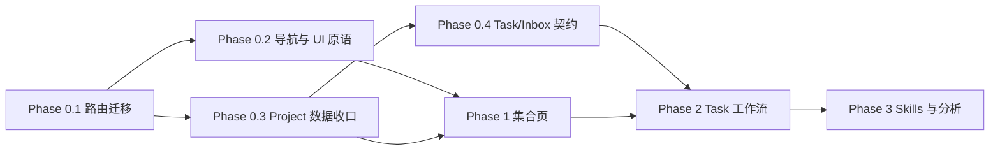

# Orvia 产品实施计划

> 品牌：Orvia
> Slogan：Intent in motion. / 让意图持续向前。
> 状态：功能优先；现有 UI 视觉、配色以及 Light / Dark / Glass 三主题暂时冻结。

## 1. 实施目标

Orvia 要从以会话为中心的智能体客户端，演进为以目标和持续执行为中心的工作管理客户端。实施中保持四个概念边界：

- **Task**：用户希望持续完成的工作目标。
- **TaskRun**：Task 的一次具体执行。
- **Session**：人与智能体交互、查看执行上下文的会话载体。
- **Automation**：触发 Task 或 Session 执行的调度规则，不与 Task 混为一体。

核心体验链路为：

`创建 Task → 触发 TaskRun → 观察进度/处理等待 → 收到 Inbox 投送 → 查看结果与产物`

## 2. 不可破坏的工程边界

### 2.1 当前范围

- 先完成信息架构、数据契约、集合页和任务工作流。
- 暂不重做 Chat 页面，不在功能开发中夹带视觉重构。
- 新集合页使用现有设计 token，为未来三主题切换保留结构，但本轮不实现新主题。
- 不复活历史上已删除的内部 `tasks` 表。产品 Task 的物理表使用 `work_items`，TaskRun 使用 `work_item_runs`。

### 2.2 Git 与 Skills 安全边界

- Skills 的 Git 仓库是 Skill 内容的唯一事实来源；Orvia 数据库只保存来源、分支、目录、版本 SHA、启用状态、绑定关系、同步状态和冲突诊断。
- **任何测试都不得向真实 Git 仓库写入。** 真实远端验证只允许 `ls-remote`、clone/fetch、读取目录和文件等只读操作。
- Git 写入流程的自动化测试必须使用临时目录中的本地 bare Git 仓库或完全 mock 的 Git adapter。
- 测试不得对真实远端执行 push、发布 commit、创建/删除分支或 tag、创建 MR、写 API、修改保护规则。
- 真实发布默认进入 Dry Run：先展示仓库、分支、目标路径、基线 SHA 和完整 diff；只有用户明确确认后，独立的 Publish 动作才可执行。
- 凭据只能由系统安全存储在运行时注入，不进入源码、配置样例、测试 fixture、日志、命令参数、计划文档或数据库明文字段。
- 每次自动测试前后比较工作区状态；测试生成物只能进入系统临时目录，不得落入源码树。

## 3. 总体依赖关系

每个切片必须独立满足：代码可运行、目标测试通过、迁移可回滚、旧数据不丢失、下一切片不依赖未提交的隐式行为。

## 4. Phase 0：稳定地基

### 0.1 Automations 路由迁移

**目标**

- 将当前调度规则页面的 canonical URL 从 `/tasks` 移到 `/automations`。
- 旧 `/tasks` 临时 `replace` 跳转到 `/automations`，避免书签失效。
- 侧栏链接与 active 状态使用 `automations`。
- Phase 2 上线真实 Task 页面时移除兼容跳转并让 `/tasks` 指向 Task Board。

**验收**

- 直接访问 `/automations` 能渲染 Automations。
- 直接访问 `/tasks` 后地址变为 `/automations` 且无历史栈污染。
- standalone 与带 basename 的 embed 路由均正确。
- Sidebar 链接为 `/automations`，仅在 Automations 页面高亮。

**回滚**

- 恢复 `/tasks` 页面路由与侧栏链接；该切片无数据迁移。

### 0.2 全局导航注册表与集合页 UI 原语

**目标**

- 建立 typed navigation registry，统一 route id、label、icon、可见性和启用阶段。
- 当前只接入已有 Inbox、Chat、Automations、Settings；不存在的 Phase 1 页面不提前做假入口。
- 保留当前会话/项目上下文树，避免一次性重写超大的 Sidebar。
- 提供仅含布局行为的共享组件：
  - `CollectionPageHeader`
  - `CollectionToolbar`
  - `EntityTable`
  - `StatusBadge`
  - `SegmentedFilter`
  - `CollectionState`
  - `EntityRowMenu`

**约束**

- 原语不包含 Project、Task、Agent 业务逻辑。
- 原语至少被三个 Phase 1 集合页复用，不为单次使用过度抽象。
- 支持键盘焦点、语义化 table/list、空态、错误态、加载态和窄屏横向处理。

**验收**

- registry 的 route id 与链接有类型检查和单元测试。
- 原语拥有 focused tests；不改变 Chat 视觉和交互。
- standalone、mobile、embed basename 不回退。

### 0.3 Project 数据收口

**目标**

- 前端集中 Project query keys、列表/详情/创建/更新/删除 hooks。
- 兼容旧 import，逐步移除 Sidebar 中 first-class `project_id` 与 legacy label 的双重读取。
- 创建 Session 时原子接受 `project_id`，后端验证项目存在且属于当前 owner。
- 删除 Project 时先清空其成员 Session 的 `project_id`，不得留下悬空引用。
- 暂不删除 legacy label 数据；停止新写后观察一个版本，再安排清理迁移。

**验收**

- 外部用户不能读取或绑定他人的 Project。
- 绑定不存在/不属于当前用户的 Project 返回明确 4xx。
- 创建 Session + Project membership 是一个可观察操作，不再依赖前端二次 patch。
- 删除 Project 后原成员 Session 保留但 `project_id` 为空。
- 现有 Project API 与 Session 列表测试全部通过。

**迁移与回滚**

- 先兼容读、后停止旧写、最后单独清理；每步可独立回滚。
- 若当前 store 不支持跨实体事务，先在 application service 中保证顺序和幂等，并记录中间失败；不得伪装成数据库事务。

### 0.4 Task / TaskRun / Inbox 事件契约

**目标**

- 只定义并验证跨端契约，不在 Phase 0 建表或实现持久 Inbox。
- Task 状态：`backlog | todo | in_progress | review | done | cancelled`。
- TaskRun 状态：`queued | running | waiting | succeeded | failed | cancelled`。
- 生命周期事件至少包含：
  - `event_id`
  - `type`
  - `occurred_at`
  - `task_id`
  - 可选 `run_id`、`session_id`、`project_id`
  - `source` / actor
  - `summary`
  - 可选 action、failure、result metadata
  - 明确的幂等/去重键
- Inbox projection 分类：`action_required | progress | completed | failed`。
- progress 默认不全部变成 unread，投送策略与事件事实分开。

**验收**

- Python/Pydantic 与 TypeScript 的枚举、必填字段和可选字段一致。
- 合法 payload 可双端解析；未知状态、缺少稳定 id、错误时间格式会被拒绝。
- 重复事件可根据幂等键识别。
- 当前审批/elicitation 和评论 Inbox 不受影响。

## 5. Phase 1：成熟的只读管理面

### 1.1 Projects 集合页

- 路由 `/projects`，支持列表、搜索、排序、状态/最近活动展示。
- 行点击进入 Project 概览；首版只读，不在集合页堆叠复杂编辑。
- 展示 session 数、最近活动、默认 agent、artifact 摘要；缺数据明确显示未知而非伪造。

### 1.2 Usage 集合页

- 路由 `/usage`，先统一展示已有 token、调用、耗时和费用估算数据。
- 提供时间范围与 project/agent 维度筛选；没有计价依据时标记为 estimate/unavailable。
- Phase 1 重点是可信汇总，不做预测和预算告警。

### 1.3 Runtime 集合页

- 路由 `/runtime`，展示 runner/provider 状态、能力、最近心跳、并发和错误摘要。
- 状态采用后端事实，不用前端轮询结果推断永久健康。
- 支持进入只读详情诊断。

### 1.4 Multi-Agent 集合页增强

- 继续使用现有 `/multi-agents` 作为唯一集合入口，不创建第二套 `/agents` 产品。
- 展示 Bundle 名称、描述、Harness、Workers、Skills、版本、校验状态、最近更新和飞书绑定状态。
- 集合页沿用并保留现有创建、导入、模板克隆、编辑、导出、删除和飞书绑定入口，不改变 Bundle 配置语义。
- Run Inspector、Bundle 详情和创建页继续使用当前路由与后端契约；本阶段只增强集合页的信息密度、搜索、筛选和状态表达。

### 1.5 Automations 增强

- 增加上次运行、下次运行、关联目标、启用状态和最近失败信息。
- 明确 Automation 是触发器，不把 cron 条目当成 Task。
- 列表与详情沿用 Phase 0 原语。

**Phase 1 总验收**

- 五个集合页共享相同的 header/toolbar/state/table 行为。
- 每页具备加载、空、错误、无权限四类状态。
- URL 可表达关键筛选，刷新后视图不丢失。
- 所有页面只读操作不会改变服务端状态。

## 6. Phase 2：Task 工作管理闭环

### 2.1 数据模型

`work_items` 至少保存：owner、project、title、description、state、priority、assignee/agent、due date、created/updated/completed time、乐观锁版本。

`work_item_runs` 至少保存：work item、session、runtime、state、trigger、queued/started/finished time、result summary、failure metadata、artifact refs、usage refs。

`inbox_items` 保存事件投影而非替代事件日志：category、read state、action state、task/run/session/project refs、event id、title/summary、timestamps。

事件事实与 Inbox 用户视图分层：一个生命周期事件可以不投送、投送一次，或更新现有投送，但不能因刷新重复生成 unread。

### 2.2 Task Board 与列表

- `/tasks` 成为真实 Task 默认入口，提供 Board/List 切换。
- Board 列与 Task state 对应；拖拽使用乐观更新和版本冲突回滚。
- 支持 Project、Agent、状态、优先级筛选；筛选条件进入 URL。
- “新建任务”先提供核心字段，不把所有高级选项塞入首屏。

### 2.3 Task 详情与运行

- `/tasks/:taskId` 展示目标、状态、运行历史、当前等待、关联会话、结果和 artifacts。
- 新执行产生独立 TaskRun；重试不覆盖失败记录。
- Session 作为可进入的上下文，TaskRun 作为可审计执行记录。

### 2.4 持久 Inbox

- `/inbox` 合并现有审批/评论与生命周期投送。
- 默认分组：需要处理、进行中、已完成、失败。
- 必投送：等待用户、需要确认、执行失败、Task 完成。
- 可配置投送：重要里程碑和长任务进度；普通高频 progress 只更新详情，不制造通知噪音。
- 支持已读/未读、批量已读、完成 action、跳转到 TaskRun/Session。

### 2.5 可靠性

- 事件写入与投影采用 outbox 或等价的可恢复机制。
- 消费端基于 event/idempotency key 幂等。
- WebSocket 负责实时体验，持久 API 负责断线恢复；不得只靠前端内存消息。

**Phase 2 总验收**

- 用户可创建 Task、启动 Run、看到状态流转、处理 waiting、收到完成/失败投送并回看结果。
- 刷新、断网重连和多标签页不会丢事件或重复 unread。
- Project 删除/归档策略不会级联误删 Task 历史。
- 迁移支持 downgrade；上线前对空库和现有生产快照各演练一次。

## 7. Phase 3：Skills、Artifacts 与深度分析

### 3.1 Git-backed Skills Inventory

- `/skills` 展示仓库目录扫描出的 Skills、版本 SHA、同步状态、校验状态、启用状态和绑定的 Agents/Projects。
- 首次同步采用只读 fetch + parse；解析 `SKILL.md` 和必要元数据，输出诊断但不自动改源文件。
- 本地缓存以 remote URL hash + branch + commit SHA 为键，支持离线读取最近一次成功快照。
- Git adapter 明确分成 `Reader` 与 `Publisher`；普通浏览/同步进程只注入 Reader 权限。

### 3.2 Skills 管理与发布

- 编辑先进入 Orvia draft workspace，不直接改远端工作树。
- Validate 检查目录结构、元数据、引用资源和敏感信息。
- Dry Run 生成完整 diff、目标分支/路径、基线 SHA 和潜在冲突。
- Publish 是单独、显式、可审计动作；发布前重新校验 remote HEAD，发生漂移即停止并要求 rebase/刷新。
- 服务端记录操作者、时间、基线/结果 SHA 和发布结果，不保存凭据。

### 3.3 Advanced Usage

- 按 Task、TaskRun、Project、Agent、Runtime、Skill 归因。
- 成本、时延、成功率、等待时间和重试率分开展示，避免单一“效率分”误导。
- 数据缺口和估算算法可见、可追溯。

### 3.4 Project Artifacts

- Project 详情提供 artifacts 集合：来源 TaskRun、文件类型、版本、创建时间、摘要和可见性。
- 引用现有文件/对象存储，不复制大文件形成第二事实源。

### 3.5 Agent Activity

- Agent 详情展示最近 Runs、当前占用、成功率、等待/失败原因、Skills 使用和关联 Projects。
- Activity 是事件的查询视图，不另建不可追溯的统计事实。

**Phase 3 总验收**

- 断开写权限时 Inventory、校验、Dry Run 仍可使用，Publish 明确禁用。
- Git 测试套件只对临时 bare 仓库写入；真实 remote 的自动化测试日志中不存在写操作。
- Skill 版本可由 commit SHA 完整追溯，冲突不会静默覆盖。
- Usage/Artifacts/Activity 均可回链到原始 TaskRun 或事件。

## 8. 测试策略

### 8.1 每个切片

1. 先写能表达契约或复现缺口的 focused test。
2. 最小实现使测试通过。
3. 运行受影响模块的测试、类型检查与 lint。
4. 对数据迁移运行 upgrade/downgrade/upgrade。
5. 比较测试前后 `git status --short`，确认没有测试生成物或非预期改写。

### 8.2 分层验证

- 前端：Vitest + Testing Library，覆盖路由、状态、键盘操作、空/错/加载态。
- 后端：pytest，覆盖 schema、owner isolation、幂等、状态机和 API 错误语义。
- 数据库：迁移演练、约束、索引和并发版本测试。
- 端到端：创建 Task → Run → waiting → action → completed/failed → Inbox → 详情回链。
- Git：临时 bare remote 集成测试；真实 remote 仅做经授权的只读 smoke test。

### 8.3 阶段门禁

- Phase 0：旧功能无回退，路由/Project/事件契约稳定。
- Phase 1：集合页一致且所有读取结果可信。
- Phase 2：任务闭环、事件持久、断线恢复和幂等通过。
- Phase 3：Git 权限隔离、Dry Run、冲突保护和可追溯性通过。

## 9. 交付顺序与发布策略

建议按以下可独立上线的顺序推进：

1. `/automations` 路由迁移。
2. navigation registry 与最小 UI primitives。
3. Project 数据收口。
4. 生命周期契约。
5. Phase 1 五个只读集合页逐页交付。
6. Task 数据模型与只读 Board。
7. Task 创建/状态更新与 TaskRun。
8. 持久 Inbox 与实时投送。
9. Git-backed Skills 只读 Inventory。
10. Skills Draft / Validate / Dry Run。
11. 经安全评审后再开放显式 Publish。
12. Advanced Usage、Artifacts、Agent Activity。

高风险能力通过 feature flag 分阶段开放。数据库采用 additive migration；旧字段和兼容路由至少保留一个明确发布周期，再依据真实使用情况移除。任何远端写能力默认关闭，不能因测试、启动同步或打开页面而触发。
