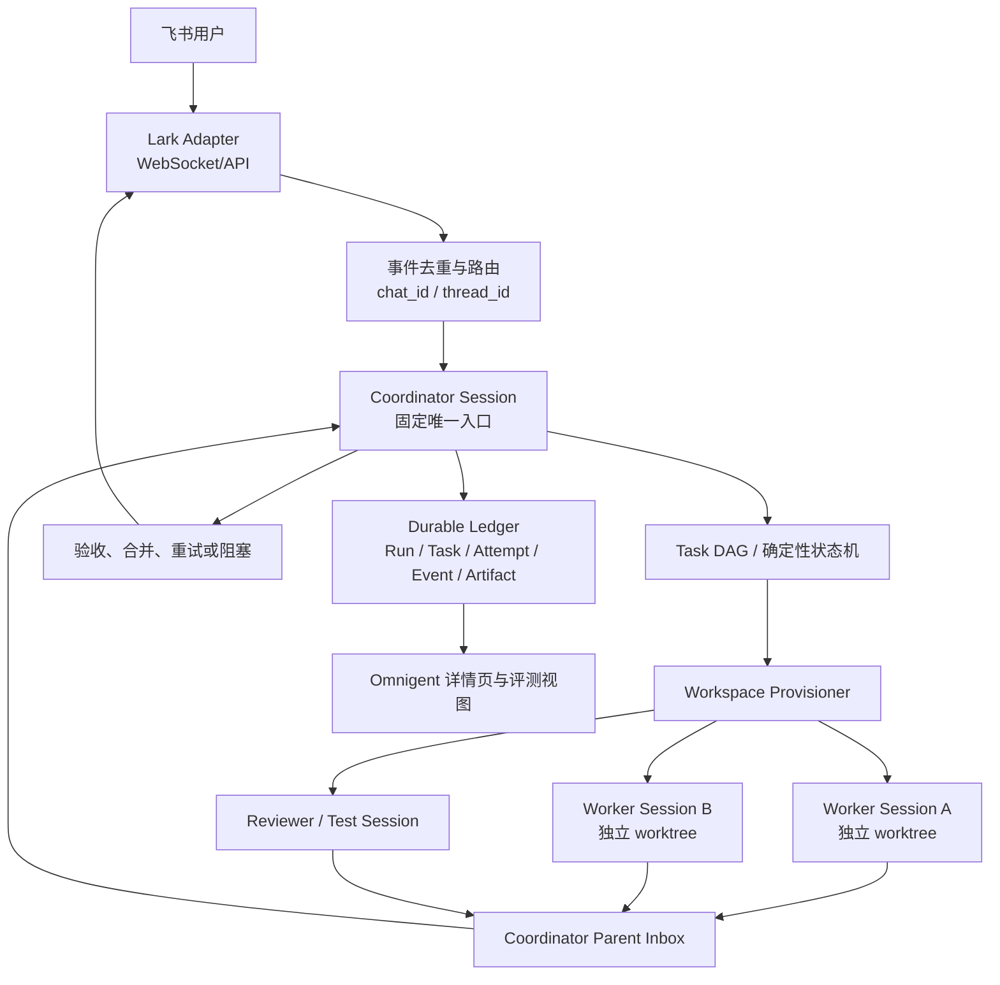

# Omnigent × 飞书团队多 Agent Harness 设计规格

日期：2026-08-03
状态：设计已获用户确认，待实施计划
基线：本地 Omnigent fork（`main` 当前版本）

## 1. 背景与目标

目标是在本地 Omnigent 之上构建一个面向多微服务项目的团队多 Agent Harness。用户从飞书发起任务，固定的 Coordinator 负责理解需求、拆解任务、选择 Worker、协调依赖、验收交付；Worker 在独立 Git worktree 中执行。除真正的 Hard Block 外，流程不要求人工评论或人工推动。

### 目标能力

1. Agent 可自主执行任务；
2. Coordinator 可自主编排多个 Agent 的依赖和并行关系；
3. Run、Task、Attempt、Session、事件、工具调用和产物可追溯；
4. 可按 Run 重放和比较 Agent/Harness/策略的表现；
5. 通过并发、配额、超时和 worktree lease 控制资源；
6. 从飞书选择本地工作区，并接收进度、失败、阻塞和最终结果。

### 非目标

- 飞书不作为任务状态数据库或 Agent 间消息总线；
- 不允许用户在飞书直接绕过 Coordinator 驱动 Worker；
- 第一阶段不引入 Temporal、LangGraph 等外部工作流引擎；
- 不把多个独立微服务仓库合并成一个 Git 仓库；
- 不让 Agent 配置保存飞书 App Secret 等敏感凭证。

## 2. 已确认的架构决策

- 采用“Omnigent 内置 Coordinator + Lark Adapter”路线；
- 飞书连接逻辑上归属于 Team/Coordinator，运行时由独立 Lark Adapter 维护；
- 一个飞书群或话题默认绑定一个 Coordinator；
- 所有用户任务先进入 Coordinator；直接 `@Worker` 时由 Adapter 转交 Coordinator；
- Run、Task、Attempt、依赖、事件和执行日志的事实来源是 Omnigent Durable Ledger；
- Worker 完成通过 Omnigent Parent Inbox 自动唤醒 Coordinator，不依赖人工评论；
- 一个可写 Attempt = 一个 Worker Session + 一个或多个独立 Git worktree；
- Agent Profile 是可并发实例化的能力模板，不是永久占用的单进程；
- “动态 Agent 路由”仅指 Coordinator 为每个阶段选择 Worker Profile，不改变飞书连接和 Coordinator 身份；
- 工作区切换采用“话题默认值 + 单条 Run 临时覆盖”；运行中的 Run 不迁移工作区。

## 3. 总体架构



### 组件职责

#### Lark Adapter

维护飞书 WebSocket 长连接或 API 客户端；验证和去重事件；将 `chat_id/thread_id` 映射到 Team、Coordinator 和默认 Workspace；处理命令、卡片按钮、回复、更新和发送重试；将 Omnigent 事件转换为聚合通知。Adapter 不决定业务任务是否完成。

#### Coordinator Session

是拥有编排权限的特殊 Omnigent Session。它负责需求解析、计划版本、Task DAG、Worker Profile 选择、依赖重算、失败处理、测试/Review 触发、合并与最终交付。状态机负责确定性状态迁移，模型只提交计划和动作建议。

#### Worker/Reviewer Session

每个 Session 执行一个具体 Attempt。Worker 只通过结构化事件、产物和 Parent Inbox 回传，不直接修改其他 Session 或使用飞书协调其他 Worker。

#### Durable Ledger

追加式记录 Run、Task、Attempt、Session、Dependency、Event、Artifact、Approval 和 Notification，并为幂等、恢复、审计和评测提供查询接口。

#### Workspace Provisioner

解析 Workspace Registry 和 `.workbench-workspace.json`，校验 Git 根目录，创建/回收 worktree lease，生成每个 Attempt 的工作区映射和启动上下文。

## 4. 飞书连接、配对与路由

### 4.1 连接归属

从用户视角，连接入口位于 Team/Coordinator 配置：

```yaml
team:
  id: dev-team
  coordinator: polly
  feishu:
    connection: default
    inbound_chat: oc_xxx
    mention_required: true
```

运行时，连接由共享的 Lark Adapter 维护，而不是由 Coordinator Session 自己创建 WebSocket。一个 Feishu App 连接可以承载多个 Agent 的显示身份，但所有入站任务仍然路由到 Coordinator。

### 4.2 Agent Pairing

Agent 可配置飞书显示和通知配对：

```yaml
agents:
  - id: polly
    role: coordinator
    feishu:
      display_name: Polly
      notify: [progress, block, final]
  - id: backend
    role: worker
    feishu:
      display_name: 后端 Worker
      notify: [failure]
  - id: reviewer
    role: reviewer
    feishu:
      display_name: Review Agent
      notify: [review]
```

Pairing 用于显示名称、头像、通知策略和消息目标，不授予 Worker 绕过 Coordinator 的入站权限。凭证由 Adapter/运行环境密钥管理，不进入 Agent YAML、Prompt 或 Ledger 明文。

### 4.3 消息入口

支持群消息、话题消息和命令/卡片操作，统一转换为 `RunRequest`：

```json
{
  "source": "feishu",
  "chat_id": "oc_xxx",
  "thread_id": "omt_xxx",
  "sender_open_id": "ou_xxx",
  "workspace_id": "luxury-resale-settlement",
  "text": "修复清分后不支持判商家责任的问题",
  "attachments": []
}
```

用户直接 `@Worker` 时，Adapter 将文本和上下文交给 Coordinator 重新判断，而不是创建 Worker Run。

### 4.4 工作区切换

```text
/workspace list
/workspace use <workspace-id>
/workspace current
```

`/workspace use` 更新当前话题/群的新 Run 默认值；卡片选择可以对单条 Run 临时覆盖。运行中的 Run 固定其 `workspace_id`，不得被切换操作修改。切换动作、操作者和生效范围写入 Ledger。

## 5. Workspace Bundle 与多仓支持

### 5.1 目录兼容原则

Workspace 是一个需求/项目目录，不要求自身是 Git 仓库；其下可以保留多个同级独立 Git 仓库以及需求元数据。例如：

```text
二奢寄卖-清分后不支持判商家责任/
├── .workbench-workspace.json
├── planet/.git
├── ZZAftersale/.git
├── ass_core_logic/.git
├── ass_api/.git
└── ...
```

`.workbench-workspace.json` 的 `expertProjects` 作为仓库清单来源，同时允许显式配置相对路径、角色、默认分支、读写权限、启动命令和验证命令。

### 5.2 Registry 数据

```yaml
workspace:
  id: luxury-resale-settlement
  root: /Users/zzzz/workbench-projects/projects/二奢寄卖-清分后不支持判商家责任
  manifest: .workbench-workspace.json
  repositories:
    - id: ass_api
      path: ass_api
      role: backend-api
      writable: true
    - id: planet
      path: planet
      role: frontend
      writable: true
```

Provisioner 启动前检查路径归属、Git 根、当前 HEAD、未提交改动和权限；工作区原目录只用于读取元数据和创建来源引用。

### 5.3 Attempt 工作区

```text
~/.omnigent/runs/<run-id>/worktrees/
├── ass_api/
├── ass_core_logic/
├── planet/
└── ZZAftersale/
```

每个仓库生成独立分支和 worktree。一个多仓 Attempt 可以持有多个 worktree lease；更优先的拆解方式是将不同仓库拆成 Task DAG 节点。每个仓库单独记录 base commit、output commit、测试、Review 和合并结果。

## 6. Task DAG、自主编排与动态 Worker Profile

### 6.1 生命周期

```text
RECEIVED → PLANNING → READY → RUNNING
RUNNING → SUCCEEDED | FAILED | TIMED_OUT | BLOCKED
FAILED/TIMED_OUT → RETRYING → RUNNING
SUCCEEDED → VERIFYING → COMPLETED
VERIFYING → REPAIRING → RUNNING
```

状态机根据依赖、事件幂等键、产物完整性、重试预算和策略权限推进状态；自然语言评论不能单独推进状态。

### 6.2 并行

无依赖的 Task 同时创建 Attempt。并行基本单位是 Attempt，而非 Agent 定义：同一 Profile 可生成多个 Session，每个写入不同 worktree。Team、Host、Profile 和 Provider 分层施加并发上限。

### 6.3 Worker Profile Selection

Coordinator 固定不变；它为每个阶段选择 Worker Profile：

```yaml
worker_profiles:
  backend:
    harness: codex-native
    capabilities: [java, spring, mysql]
  frontend:
    harness: claude-native
    capabilities: [react, vue, typescript]
  reviewer:
    harness: openai-agents
    capabilities: [review, security, test-analysis]
```

选择依据为能力匹配、Harness 在线状态、并发和资源、工作区权限、历史成功率、风险和 Provider 配额。阶段切换创建新 Attempt，并携带前一阶段的结构化上下文和产物，不在同一个 Session 中途更换模型。

### 6.4 Worker 回传

```text
Worker Session 结束
  → worker_done / worker_failed 事件
  → Coordinator Parent Inbox
  → Coordinator 自动唤醒
  → 状态机重算依赖
  → 启动后继 Task、测试、Review 或修复
```

没有结构化完成事件的自然语言输出不视为完成，进入补偿查询或 `invalid_output` 处理。

## 7. 失败恢复、权限与人工介入

失败分类至少包括：`provider_error`、`workspace_error`、`tool_error`、`policy_denied`、`timeout`、`invalid_output`、`dependency_blocked` 和 `human_decision_required`。失败记录原始错误、阶段、命令/工具、最后心跳、Session、建议动作和是否可重试。

默认自动动作包括有限重试、备用 Harness、备用 Profile、测试失败修复、Review 修复和通知重试。只有业务取舍、生产权限、不可逆操作、重试耗尽或无法推断的依赖冲突升级为 Hard Block。

Policy 默认低风险操作 `ALLOW`；危险、不可逆或生产操作 `ASK`。审批事件绑定 Run/Task/Attempt，并记录决策者、决策内容和生效时间。

## 8. 可追溯性、通知与评测

事件链为：

```text
Feishu Event → Run → Plan Revision → Task → Attempt → Session
→ Tool Call → Command Result → Artifact → Review → Notification
```

每个事件关联 `run_id`、`task_id`、`attempt_id`、`session_id`、`workspace_id`、`repository_id`、`worktree_path`、`agent_profile`、`harness`、`model`、时间戳和父事件。

飞书只推送聚合进度、阶段结果、明确失败、Hard Block 和最终交付；Omnigent 详情页保留完整工具调用、日志、Prompt/响应摘要、测试和 Review 产物。

第一阶段评测指标：Run/Task 成功率、自动完成率、人工介入率、重试率、耗时、并行度、资源利用率、测试通过率、Review 发现数、错误分类、Profile/Harness 成功率和成本。Ledger 支持 Run 重放，用于比较 Prompt、路由、并发和重试策略。

## 9. 测试与验收标准

必须验证：

1. 飞书重复事件不会创建重复 Run；
2. 工作区切换只影响新 Run；
3. 同一 Profile 的多个 Attempt 使用不同 worktree 并行；
4. 多仓任务遵循依赖并分别记录提交和测试；
5. Worker 完成无需人工评论即可唤醒 Coordinator；
6. 失败通知包含阶段、类型、原始原因和自动动作；
7. Host 重启后可从 Ledger 恢复；
8. 飞书通知失败不改变 Omnigent 真实状态；
9. 直接 `@Worker` 不会绕过 Coordinator；
10. 只有 Hard Block 进入人工审批；
11. 最终卡片包含各仓库提交、测试和 Review 产物链接。

## 10. 分阶段实施范围

### Phase 1：单机可靠闭环

- Lark Adapter WebSocket；
- Team/Coordinator 绑定；
- Workspace Registry 和 `/workspace` 命令；
- Run/Task/Attempt/Event 最小 Ledger；
- Coordinator Parent Inbox 自动唤醒；
- 多仓 manifest 解析和独立 worktree；
- Codex/Claude Worker Profile；
- 自动测试、Review、失败分类和飞书汇总通知。

### Phase 2：恢复与治理

- Durable Ledger 完整持久化；
- Host 重启恢复；
- 分层资源限流和 worktree lease 回收；
- Policy 审批和 Hard Block 卡片；
- Worker 失败自动换 Profile/Harness；
- 详情页事件追踪。

### Phase 3：评测与规模化

- Run 重放；
- Profile/Harness 对比评测；
- 成本与质量报表；
- 多 Team、多 Feishu App；
- 可选外部队列或工作流持久化组件。

## 11. 关键取舍

- 连接集中在 Adapter，避免每个 Agent 建立 WebSocket 和重复消费事件；
- Coordinator 作为唯一入口，换取状态一致性和低人工介入；
- Worker 间不直接通信，换取可追溯、可恢复和可评测；
- 每 Attempt 独立 worktree，换取真实并行和清晰合并边界；
- 状态机约束模型建议，换取幂等和故障恢复；
- 飞书只展示聚合结果，换取低噪声和稳定性；
- 首阶段不引入外部工作流引擎，降低本地部署复杂度。
