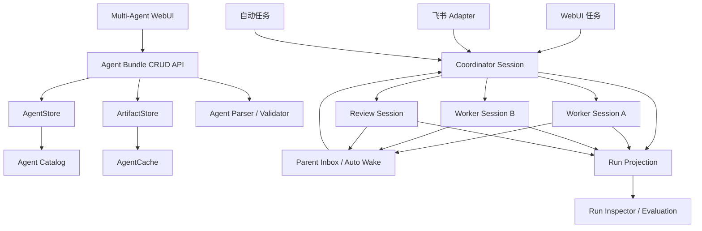

# Omnigent Multi-Agent Bundle Builder 设计规格

日期：2026-08-04  
状态：设计已确认，进入实施计划  
基线分支：`team-harness`  
取代：`2026-08-03-omnigent-feishu-team-harness-design.md` 中以 `Team / AgentProfile / TeamMember` 作为配置真源的部分

## 1. 背景

Omnigent 已经能够运行 Polly 这类真正的多 Agent Bundle：根 `config.yaml`
定义 Coordinator，`tools.agents` 与 `agents/*/config.yaml` 定义可调用的
Worker。现有 WebUI 的“创建自定义智能体”只能生成很小的 Session-scoped
Bundle；此前新增的 Team Builder 又把 Coordinator、Worker、Harness 和并发保存
成另一套数据库 JSON，无法表达 Polly 的 Prompt、Executor、Tools、Skills、MCP、
Terminals、OS Environment、Guardrails、Policies、Async、Timers 和 Spawn。

本设计将产品入口统一为 **Multi-Agent**，让用户不用手写 YAML，也能在 WebUI
中创建、复制、完整配置、校验、运行和连接飞书。页面直接编辑真实 Agent Bundle，
不再保存第二套 Team 配置。

## 2. 目标

1. Agent Bundle 是 Multi-Agent 配置的唯一事实来源。
2. 内置 Polly 可直接查看和运行，并可复制成用户可编辑的 Multi-Agent。
3. 页面尽可能覆盖当前 Agent YAML 的全部正式字段。
4. Coordinator 与 Worker 复用同一套完整 Agent 配置内核。
5. 表单与 Advanced YAML 双向同步，未知字段和未修改文件不会因保存而丢失。
6. 用户创建的 Bundle 是长期 Template，可由 WebUI、飞书和自动任务重复运行。
7. 固定 Coordinator 作为唯一入口，在运行时动态选择并并行调度 Worker。
8. Worker 完成或失败自动唤醒 Coordinator，无需人工评论推进。
9. 每个 Run 固定 Agent Bundle 版本和 Workspace，支持本地多仓目录。
10. Run、Task、Attempt、Session、工具调用、日志、产物和决策可追踪、可评测。
11. 新功能完整支持 English 和简体中文，并沿用现有 Omnigent 视觉语言。
12. 飞书只作为任务入口、通知和必要审批界面；真实状态保存在 Omnigent。

## 3. 非目标

- 不新增与 Agent Bundle 平行的 Team、AgentProfile 或 TeamMember 配置模型。
- 不把 Polly 的 `name` 统一改成 `multi-agent`；Multi-Agent 是模块名，Polly 是实例名。
- 不提供一个与 Omnigent Session 工具并行的第二套 Coordinator 执行引擎。
- 第一阶段不实现通用可视化 DAG/Stage 工作流设计器；编排由 Coordinator
  Prompt、Skills、`tools.agents`、Async 和 Guardrails 驱动。
- 不允许 Worker 绕过 Coordinator 直接消费飞书入站消息。
- 不允许同级 Worker 任意互发消息。
- 不把某次本地工作目录写死进 Agent Bundle。
- 不把飞书凭据、Provider Token 或本地 Secret 明文写入 Bundle、日志或前端状态。
- 不重做已有页面汉化；只补齐本次新增和修改的界面文案。

## 4. 核心领域模型

### 4.1 唯一配置真源

```text
Agent
├── id
├── name
├── description
├── version
└── bundle_location
        │
        ▼
    ArtifactStore
        │
        ▼
    agent.tar.gz
    ├── config.yaml                 # Coordinator
    ├── AGENTS.md
    ├── agents/
    │   ├── claude/config.yaml      # Worker
    │   ├── codex/config.yaml       # Worker
    │   └── reviewer/config.yaml    # Worker
    ├── skills/*/SKILL.md
    └── tools/
        ├── mcp/
        ├── python/
        └── typescript/
```

数据库只保存 Agent 元数据和当前 Bundle Artifact 引用。完整配置由 Bundle 文件
承载。WebUI 可以使用结构化 DTO 编辑，但 DTO 不是持久化真源。

### 4.2 Agent 生命周期

| 类型 | 示例 | 长期保存 | 可编辑 | 可绑定飞书 |
| --- | --- | --- | --- | --- |
| 内置 Template | Polly、Debby | 是 | 否 | 否 |
| 用户 Template | 研发小队 | 是 | 是 | 是 |
| Session-scoped Agent | 旧的新会话临时 Agent | 随会话 | 会话级 | 否 |

内置 Template 使用确定性的内置 ID，并由服务启动时的 seed 逻辑刷新。用户必须
通过“使用此模板”复制为新的随机 Agent ID，才能编辑和连接飞书。

### 4.3 Multi-Agent 与 Single Agent

两者使用同一个 Agent Bundle 领域：

- 没有 `tools.agents`/`agents/*` 的 Bundle 是 Single Agent。
- 包含 Coordinator 与一个或多个 Worker 的 Bundle 在 Multi-Agent 模块展示。
- 用户可以在创建时选择 Single Agent 或 Multi-Agent，但配置字段和保存 API 复用。
- 本设计优先完成 Multi-Agent 页面，并抽取共享 `AgentConfigForm` 供现有
  `CreateAgentDialog` 后续复用。

## 5. 总体架构



Agent Bundle 决定“谁工作、如何协作、允许使用什么”；Workspace 决定“本次在
哪里工作”；Run 固定“某个 Bundle 版本 + 某个 Workspace + 某个任务”。

## 6. WebUI 信息架构

### 6.1 导航与命名

左侧一级入口为 `Multi-Agent`。实例仍显示自己的 Bundle 名称，例如 Polly、
Debby、研发小队。中文和英文界面都保留模块名 `Multi-Agent`；操作、说明、
错误和空状态随全局语言切换。

### 6.2 卡片列表

每张卡片代表一个真实、可运行的 Agent Bundle，展示：

- 名称、图标和描述；
- 内置模板或用户自定义；
- 当前 Bundle 版本；
- Coordinator Harness 与解析后的模型来源；
- Worker 数量及主要 Worker 名称；
- Skills/MCP 数量；
- Bundle 校验状态；
- 飞书连接状态；
- 最近更新时间和最近 Run 状态；
- 查看、使用模板、编辑、运行和更多操作。

内置 Polly 显示“查看/使用此模板”；用户 Bundle 显示“编辑/运行”。Bundle
无效时卡片展示首个关键错误并禁用运行。完整 Prompt、Tools、Environment 和
YAML 不塞进卡片，进入编辑页查看。

### 6.3 编辑页

编辑页使用现有白底、细边框、圆角卡片、原表单控件和黑色主按钮：

```text
Multi-Agent / Edit Polly

顶部：Bundle 状态 | 测试运行 | 连接飞书 | 保存 | 更多

左侧导航                  中间配置
├── Overview              当前分组的结构化表单
├── Coordinator
├── Workers
│   ├── Claude Code
│   ├── Codex
│   └── Reviewer
├── Skills & Tools
├── MCP Servers
├── Runtime & Terminals
├── Environment & Secrets
├── Sandbox & OS Access
├── Guardrails & Policies
├── Async & Timers
├── Feishu
└── Advanced YAML

底部：未保存状态 | 校验错误 | Bundle 版本和实际位置
```

### 6.4 共享配置内核

抽取共享 `AgentConfigForm`：

```text
AgentConfigForm
├── IdentitySection
├── InstructionsSection
├── ExecutorSection
├── ModelSection
├── InteractionSection
├── SkillsSection
├── ToolsSection
├── MCPSection
├── RuntimeSection
├── EnvironmentSection
├── SandboxSection
├── GuardrailsSection
└── AdvancedFieldsSection
```

现有自定义 Agent、Multi-Agent Coordinator 和每个 Worker 都复用这一内核。
Multi-Agent Builder 只额外负责 Worker 文件结构、编排关系、Bundle 校验和飞书
绑定。

### 6.5 Basic 与 Advanced

Basic 只显示日常字段；Advanced 显示当前 Schema 的完整字段。两者是同一数据，
切换不会清空高级配置。未知或未来扩展通过通用结构化编辑器和 Advanced YAML
兜底。

## 7. 配置字段覆盖

当前正式 Schema 字段尽可能全部提供结构化控件：

- `spec_version`、`name`、`description`；
- `prompt`、`instructions` 和 `AGENTS.md`；
- `llm`、`interaction`、`params`；
- `executor.type/model/context_window/auth/config` 与 Harness 专属字段；
- `tools.agents`、`tools.builtins`、Tool Timeout/Retry/Sandbox；
- Bundled Skills、`skills` Filter；
- MCP Server 与 Python/TypeScript Local Tools；
- `os_env`、Sandbox、Write Paths、Network、Egress、Credential Proxy；
- Terminals、命令、参数、环境、Scrollback；
- Policies、Guardrails、Labels、ASK Timeout；
- Compaction；
- `async`、`timers`、`spawn`、`agent_session_sharing`；
- 服务器当前 Schema 支持的其他字段。

简单类型由 Schema 通用渲染；Worker、MCP、Policy、Sandbox、Credential Proxy、
Terminal、Params 和 Executor Auth 使用专用编辑器。页面不发明运行时不支持的
字段。

### 7.1 Default 语义

`Use local default` 表示删除/省略 YAML 字段，不是把当前机器解析到的值写死。
页面单独显示解析结果和来源。模型优先级为：

```text
Run / Dispatch Override
    > Bundle 显式 Model
    > ~/.omnigent Provider Default
    > Native CLI Local Default
    > Harness Fallback
```

布尔和可继承字段使用三态：Default、Enabled、Disabled。缺省、空列表和显式默认
必须保持区别。

## 8. YAML 无损往返

### 8.1 双层编辑模型

不能把 `AgentSpec` 直接 `safe_dump` 回 YAML，因为会丢注释、顺序、引号、块
文本风格和未知字段。编辑链路采用：

```text
原始 Bundle 文档
  ├── Round-trip YAML Document → 接收字段级 Patch
  └── Omnigent Parser → AgentSpec → Schema 表单

候选 Bundle → Omnigent Parser/Validator → 保存新 Artifact
```

Round-trip 编辑器建议使用 `ruamel.yaml`；它只负责局部文档修改，不替代原生
Parser/Validator。

### 8.2 保存保证

- 未修改文件字节级不变；
- 已修改 YAML 中的未知字段、未触碰注释和顺序保留；
- 用户修改的节点允许局部重新格式化；
- 删除字段只删除目标路径；
- Bundle 中额外文件原样保留；
- 页面未识别但服务器支持的字段仍可校验保存；
- 服务器不支持的字段保留用于查看/导出，但不能伪装成有效可运行版本。

### 8.3 Prompt 来源

如果配置使用 `instructions: AGENTS.md`，表单编辑系统指令时修改 `AGENTS.md`，
不自动转成内联 `prompt`。只有用户主动选择转换时才改变存储方式。

### 8.4 Advanced YAML 同步

Advanced YAML 使用 Monaco 和 Bundle 文件树。表单修改生成字段级 Patch 并更新
预览；YAML 修改成功解析后刷新表单。语法错误时保留编辑文本、暂停对应表单
同步、精确显示文件/行/列，并禁用保存和测试运行，不能静默恢复旧内容。

## 9. Worker 文件操作

新增 Worker 原子完成：创建 `agents/<name>/config.yaml`、可选 `AGENTS.md`、
更新根 `tools.agents`、递归校验。重命名同步修改目录、Worker 名称和正式引用；
删除前列出引用；复制完整目录及资源。

不实现 UI 私有的隐藏继承。页面提供“复制 Coordinator”“复制 Worker”“批量
应用到所选 Worker”，最终都生成显式 YAML Patch。修改 Coordinator 不会暗中
修改已复制 Worker。

## 10. Agent Bundle CRUD API

扩展现有 Agent 领域，不新增 `/v1/teams` 配置 API：

```text
GET    /v1/agents
GET    /v1/agents/{id}/bundle
POST   /v1/agents/validate
POST   /v1/agents
PUT    /v1/agents/{id}
DELETE /v1/agents/{id}
POST   /v1/agents/{id}/clone
POST   /v1/agents/import
GET    /v1/agents/{id}/export
GET    /v1/agent-spec/schema
```

### 10.1 创建与更新

写入顺序：安全解包、应用 Patch、原生解析和校验、计算 Digest、写 Artifact、
创建/更新 AgentStore、使 Cache 失效并重新加载。任一步失败都不能把旧有效
Bundle 替换掉。

更新携带 `expected_version`；版本冲突返回 409，不静默覆盖。相同 Digest 可返回
“无变化”而不增加版本。内置 Agent 的更新和删除在后端拒绝。

### 10.2 克隆

“使用此模板”复制完整 Bundle 并生成新 Agent ID/version=1，不复制飞书连接、
Run 或会话。导出的 Bundle 必须能直接由 `omnigent run <path>` 使用。

### 10.3 校验诊断

诊断至少包含 severity、code、file、field path、line、column、Coordinator/Worker
身份、原始消息和本地化摘要键。校验覆盖 YAML 语法、路径安全、Schema、
AgentSpec、Worker 引用、Skills/Tools/MCP、Executor、Policy 和完整 Cache 加载。

## 11. Coordinator、动态路由与并发

### 11.1 固定入口

WebUI、飞书和自动任务都创建根 Coordinator Session。动态路由发生在
Coordinator 之后，不改变飞书连接身份。

### 11.2 Worker 并发实例

Worker 配置是可重复实例化的模板。`sys_session_send` 的 `(agent, title)` 标识
子 Session：同一 agent 不同 title 创建不同子 Session，并发执行；同一 title
继续原 Session，忙碌时返回 `sub_agent_busy`。并行限制使用真实 Policy、Host、
Provider 和 Session 资源约束，不复用旧 Team 页的无效 `concurrency` 字段。

### 11.3 动态选择

运行时将声明的 Worker 名称和 description 写入 `sys_session_send` Schema，
Coordinator 根据任务类型、能力、Harness 可用性、模型、成本和前序结果选择。
`args.model` 可对单次 Dispatch 覆盖模型；Harness Override 只有 Worker 的
`allowed_harnesses` 明确允许时才暴露和执行。

### 11.4 自动唤醒

Worker 完成、失败、启动失败或阻塞通过 `async_work_complete`/Parent Inbox
唤醒 Coordinator，生成 continuation turn。无 Hard Block 时不要求人工确认、
评论或 `@Coordinator`。Coordinator 可以综合、派发第二轮、切换 Worker、执行
跨模型 Review 或输出最终结果。

### 11.5 通信拓扑

默认是 Coordinator 与直接 Child Worker 的树形拓扑。同级 Worker 不直接通信；
实现结果经 Coordinator 转交给 Reviewer。Worker 若自身显式声明 `tools.agents`
或 `spawn: true`，可以形成下一层子树，但仍受直接 Child 权限约束。

## 12. Workspace 与多仓运行

### 12.1 Bundle 与 Workspace 分离

Bundle 不永久保存某次本地路径。每次创建 Run 时从 WebUI、飞书话题默认值或
请求 Override 选择 Workspace。

```text
Multi-Agent Bundle + Bundle Version + Workspace + Input = Run
```

运行开始后 `workspace_id` 不可变；切换只影响后续新 Run。

### 12.2 目录兼容

Workspace 根目录可以不是 Git 仓库，并兼容现有多微服务结构：

```text
二奢寄卖-清分后不支持判商家责任/
├── .workbench-workspace.json
├── planet/.git
├── ZZAftersale/.git
├── ass_core_logic/.git
└── ass_api/.git
```

Registry 读取 `expertProjects` 或显式 repositories，保存相对路径、角色、默认
分支和读写权限。绝对路径、`..`、嵌套越界和非预期 Symlink 必须拒绝。

### 12.3 Worktree

需要写入的 Worker Session 获取 Attempt-scoped、多仓 Worktree Lease。无依赖的
任务可并行使用不同工作树；同一 Worker 配置也可同时拥有多个不同 title 的
子 Session 和不同 Lease。每仓记录 Base Commit、分支、输出 Commit、测试和
产物。只读探索可按策略共享原工作区视图。

## 13. Run、Task、Attempt 与追踪投影

此前 Team Harness 的 Run/DAG 不能继续作为与 Polly 并行的执行引擎。本设计
将其改为真实 Session 树的持久化投影：

```text
Run
  = Root Coordinator Session
  + agent_id
  + agent_version
  + bundle_digest
  + workspace_id
  + source

Task
  = Coordinator 派发的逻辑任务
  = root_session_id + task title

Attempt
  = 某次 Worker Session Turn / Dispatch
  + worker name
  + worker config path
  + purpose
  + harness/model
  + child session id
```

`sys_session_send`、Session 生命周期、Tool Event、Inbox Completion、审批和产物
事件驱动投影更新。Run Store 不自行启动另一套 Worker，也不以自然语言评论
推进状态。

Task 依赖来自 Coordinator 明确计划事件和实际 Dispatch 因果关系；缺少显式
依赖时只记录父子/时间关系，不伪造 DAG。`purpose` 使用现有 implement、review、
explore、search 语义表达阶段。

已经启动的 Run 固定 `agent_version` 和 `bundle_digest`；编辑 Template 不改变
正在运行或历史 Run。新 Run 默认使用最新有效版本。

## 14. 可追溯性与评测

### 14.1 事件链

```text
Feishu/Web Event → Run → Root Session → Dispatch → Task → Attempt
→ Worker Session → Tool Call/Command → Result → Inbox → Coordinator Decision
→ Review/Repair → Artifact → Notification → Final Output
```

关键记录包括 Run/Task/Attempt/Session ID、Agent ID/Version/Digest、Workspace/
Repository/Worktree、Worker、Harness、Model、Prompt/Skill 版本、输入输出 Token、
耗时、失败码、重试、审批、测试、Commit 和产物引用。Secret 和完整敏感请求体
不进入 Ledger。

### 14.2 Run Inspector

Inspector 展示：

- 根 Coordinator 与 Worker Session 树；
- 时间轴和真实并行重叠；
- Task/Attempt 状态、Purpose、Harness 和 Model；
- Worker 详细对话、工具调用、终端日志和失败原因；
- 每仓 Worktree、Commit、测试和 Review；
- Coordinator 被唤醒后的决策链；
- 飞书通知状态和最终交付。

用户可以进入每个 Worker 的现有 Session 详情，不复制一份聊天日志到 Run 表。

### 14.3 指标

第一阶段从 Ledger/Session 事件聚合：

- Run/Task 成功率和首次成功率；
- 自动完成率、人工介入率和 Hard Block 率；
- 重试率、Worker/Harness/Model 失败率；
- 总耗时、关键路径耗时和实际并行度；
- Token、模型成本、Host 时间和 Worktree 使用；
- 测试通过率、Review 发现数和修复轮次；
- 不同 Agent Bundle Version 的效果差异。

评测不从飞书消息反推真实状态。Run 比较必须显示不同 Bundle Digest、Workspace
基线和输入差异，避免错误归因。

## 15. 飞书集成

### 15.1 绑定归属

“连接飞书”位于用户 Multi-Agent 卡片和编辑页右上角。绑定对象是稳定的
`agent_id`，不是旧 Team ID，也不是某个 Worker。内置模板必须先复制。

Installation 与 Agent Bundle 分开存储，因为凭据、聊天绑定、Surface 和通知
偏好属于 Adapter 运维状态，不属于可导出的 Agent YAML。绑定默认使用该
Agent 的最新有效版本；每次 Run 仍固定实际版本和 Digest。

### 15.2 Device Flow

继续使用已修复的飞书 PersonalAgent 注册：

```text
POST https://accounts.feishu.cn/oauth/v1/app/registration
Content-Type: application/x-www-form-urlencoded
```

WebUI 显示二维码并按照 provider 的 interval 轮询；pending 时二维码持续显示。
成功后加密保存凭据，记录 Bot 信息，并幂等初始化 Surface。

Agent-scoped API：

```text
POST /v1/agents/{agent_id}/feishu/installations
GET  /v1/agents/{agent_id}/feishu/installations/{session}
GET  /v1/agents/{agent_id}/feishu
DELETE /v1/agents/{agent_id}/feishu
POST /v1/agents/{agent_id}/feishu/surface/reinitialize
```

旧通用 Device Flow Endpoint 可以作为兼容入口，但完成时必须绑定 Agent ID。

### 15.3 入站路由

`chat_id/thread_id` 映射到 Agent ID、默认 Workspace、Host/执行模式和允许成员。
所有消息创建或继续 Coordinator 根 Session。即使用户文本包含 Worker 名称，
Adapter 也只把意图交给 Coordinator，不直接写 Worker Session。

### 15.4 常驻挂件和按钮

扫码后初始化固定工作台：

```text
入口：新建任务 | 当前任务 | 全部会话 | 代码变更 | 设置
快捷：查看 Worker | 查看失败 | 切换工作区 | 查看成品 | 帮助
上下文：Workspace | Repository | Host | Execution Mode
```

如果应用级菜单 API 不可用，降级为常驻交互卡片并标记 `partial`，而不是把整个
连接判失败。重复扫码、重启和“重新初始化”不能创建重复 Surface。

写操作按钮使用服务端签名 action、nonce、成员权限、Agent/Workspace 绑定、
状态合法性和幂等校验。按钮只调用白名单动作，不能携带任意 Shell 或回调 URL。

### 15.5 通知策略

默认只推送：任务已接受、关键阶段聚合进度、明确失败、Hard Block、最终成品。
Worker 正常完成不单独刷屏，而是自动唤醒 Coordinator；只有失败或用户订阅的
Worker 状态才单独通知。通知必须包含清晰原因和下一步，不允许只显示“执行失败”。

飞书通知失败不改变 Run 状态；Adapter 重试并在 Ledger 记录投递结果。

### 15.6 Workspace 命令

```text
/workspace list
/workspace use <workspace-id>
/workspace current
```

命令只改变当前话题后续 Run 的默认值。单条新任务可以使用卡片临时 Override；
运行中的 Run 不迁移。

## 16. 错误处理、自治与人工介入

### 16.1 错误分类

至少包括：Bundle Syntax/Validation、Harness Unavailable、Provider/Auth、Workspace、
Worktree、Tool、Policy Denied、Timeout、Worker Boot、Worker Task、Invalid Output、
Dependency Blocked、Feishu Transport 和 Human Decision Required。

每个失败记录：稳定错误码、用户可读摘要、原始原因、阶段、Worker、Session、
命令/工具、最后心跳、是否可重试、已采取动作和建议下一步。

### 16.2 默认自动动作

- 网络和 Provider 瞬时错误有限重试；
- Worker Boot/Task 失败立即唤醒 Coordinator；
- Coordinator 可切换可用 Worker/模型/Harness；
- 测试失败自动派发修复；
- 实现完成后自动派发不同 Worker Review；
- Review 阻塞问题自动回到实现 Worker 或新 Worker；
- 通知失败由 Adapter 独立重试。

不要求“任务完成后人工评论才能进入 Review”。

### 16.3 Hard Block

只有业务取舍、生产/高风险权限、不可逆操作、凭据缺失且无法替代、重试耗尽或
无法自动解决的冲突升级为 Hard Block。审批绑定 Run/Task/Attempt，记录决策者、
选择和生效时间。低风险本地开发路径由 Guardrail 明确 ALLOW，危险操作 ASK 或
DENY。

## 17. 安全

- Bundle 上传使用安全解包，拒绝路径穿越、越界 Symlink、设备文件和超限内容；
- 限制 Bundle 总大小、文件数、单文件大小和 YAML 复杂度；
- 内置 Bundle 后端只读；
- 写 API 使用 Workspace 现有权限边界和版本冲突保护；
- Secret 字段只显示引用或已配置状态，API 返回脱敏值；
- 飞书 Credential 加密存储，密钥不落库；
- Webhook/Action 校验签名、时间窗、nonce 和幂等；
- Run/日志/评测不记录明文 Token；
- Workspace 路径必须在已注册根下；
- Agent/Worker 只能使用 Bundle 和 Policy 明确授予的 Tool/OS 权限。

## 18. 国际化

复用现有 `i18next + react-i18next` 和全局 System/English/简体中文偏好。新增
`multiAgent` 翻译命名空间，并补齐本次新增页面、字段说明、错误、飞书引导和
空状态。

不翻译：YAML 字段名、Agent/Skill/MCP 名称、Harness/Model ID、环境变量、路径、
命令、用户 Prompt 和 YAML 内容。中文界面可以显示本地化解释，但保留原字段
路径与原始诊断。中英文翻译键必须有自动一致性测试；切换语言不能清空草稿。

## 19. 旧 Team 模型迁移

### 19.1 产品层

- 从导航移除 Teams；新增/保留 Multi-Agent；
- 新页面不调用 `/v1/teams`；
- Team Builder、Agent Profile 配置不再作为可运行入口；
- Run Inspector 改用 Agent ID/Version/Digest，而不是 Team/Profile 配置；
- 不做 Team JSON 与 Bundle 双写。

### 19.2 数据层

已经提交的 Legacy Team 表不立即物理删除，避免破坏本地已有原型数据和迁移链；
停止新写入并标记为 Deprecated。新增迁移为 Run、Attempt 和 Feishu Installation
增加 Agent Bundle 引用。

若 Legacy Team 的 Coordinator 名称能唯一匹配现有 Agent，可自动补 Agent ID；
不唯一或无法匹配时保持 Legacy Unbound，并在管理诊断中提示重新选择/连接，绝不
进行有损自动转换。旧 Team 配置缺失 Prompt、Skills、Tools 和 Guardrails，不能
宣称可以无损转换成 Polly。

未来确认无使用后再单独迁移删除 Legacy 表；本次不执行不可恢复的数据删除。

## 20. 测试策略

### 20.1 后端

- Agent Template create/get/update/delete/clone/import/export；
- 内置 Agent 写保护；
- Version Conflict 和 Digest No-op；
- Bundle 安全解包和大小限制；
- Polly 完整 Round-trip，注释、未知字段和额外文件保留；
- Default/三态字段不被错误实体化；
- Worker 新增、复制、重命名、删除和引用校验；
- Schema、Parser、Validator 与 Cache Reload；
- Agent-scoped 飞书安装、解绑、Surface 幂等和凭据脱敏；
- Workspace 多仓解析和 Worktree Lease；
- Session 事件到 Run/Task/Attempt Projection；
- Worker 并发、失败和 Parent Auto Wake；
- Ledger 幂等与评测聚合。

### 20.2 前端

- 卡片列表的内置、自定义、无效和飞书状态；
- 创建/复制/编辑/保存/删除；
- Coordinator/Worker 共享表单；
- Harness/Model Default；
- Basic/Advanced 字段覆盖；
- Worker 文件操作；
- Advanced YAML 双向同步和语法错误；
- 409 冲突；
- 飞书二维码 Pending 保持、成功和失败；
- Workspace 选择和运行；
- Run Inspector Worker 详情；
- English/简体中文翻译完整性。

### 20.3 E2E 与真实验收

自动 E2E 必须证明：

1. 从内置 Polly 复制用户 Bundle；
2. 在页面修改 Coordinator、Worker 和 Model Default；
3. 保存后导出 Bundle 可由 CLI 解析；
4. 同一 Worker 使用不同 title 的任务真实重叠并发；
5. Worker 完成无需人工消息即可唤醒 Coordinator；
6. 实现后自动进入不同 Worker Review；
7. Worker 失败包含原因且 Coordinator 能采取动作；
8. 多仓 Workspace 保持原目录结构并创建隔离 Worktree；
9. 飞书绑定到 Agent ID，入站只进入 Coordinator；
10. 工作区切换只影响新 Run；
11. Run Inspector 可以打开每个 Worker 详情；
12. 中英文页面都能完成主流程。

最后必须启动本地服务，在右侧真实浏览器执行卡片列表、复制 Polly、编辑保存、
校验、测试运行、Workspace 选择和飞书入口验收。只运行单元测试不能代替真实
浏览器验收。

## 21. 性能与资源约束

- 列表 API 只返回摘要，不加载完整 Bundle 内容；
- Bundle 详情按需加载，Skills/Tools 大文件延迟读取；
- 表单校验防抖并可取消旧请求；
- AgentCache 按 Agent ID + Digest 复用；
- 相同 Digest 不重复保存和解压；
- Worker 并发使用现有 Session/Host/Provider 约束与 Guardrail；
- Run Inspector 分页/流式读取事件和日志；
- 飞书通知聚合，避免每个 Tool Event 都发送消息；
- Worktree Lease 有回收和重启恢复机制。

## 22. 实施顺序

1. 建立 Agent Bundle 编辑服务、Round-trip 文档与 CRUD API；
2. 增加 Run/Feishu 的 Agent Bundle 引用并停止 Team 配置写入；
3. 抽取共享 Agent 配置表单和 Schema；
4. 实现 Multi-Agent 卡片列表和编辑页；
5. 实现 Worker 文件操作和 Advanced YAML；
6. 将飞书安装与路由切换为 Agent-scoped；
7. 将 Run/Task/Attempt 改为 Session 事件投影；
8. 接入 Workspace/多仓 Worktree 和 Run Inspector；
9. 补齐国际化、迁移、测试和运行手册；
10. 完整自动测试、代码复审和右侧浏览器真实验收。

## 23. 成功标准

本设计完成的判定不是“出现一个 Multi-Agent 页面”，而是：

- 页面编辑的对象就是可运行的真实 Polly 类 Agent Bundle；
- 当前正式 YAML 字段尽可能结构化配置，未知字段无损保留；
- 没有 Team/AgentProfile 双写或运行时语义分叉；
- 同一 Worker 配置可以并发创建多个子 Session；
- Worker 完成/失败自动唤醒 Coordinator；
- 飞书固定连接 Coordinator，并可切换每次 Run 的本地多仓 Workspace；
- 所有 Run 固定 Bundle 版本并可查看 Worker 详情、日志和决策；
- 英文与简体中文主流程都可用；
- 自动测试和真实浏览器验收均通过。
